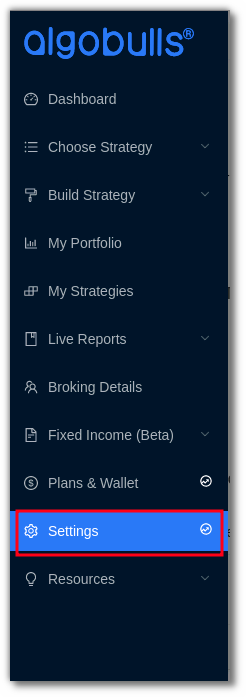
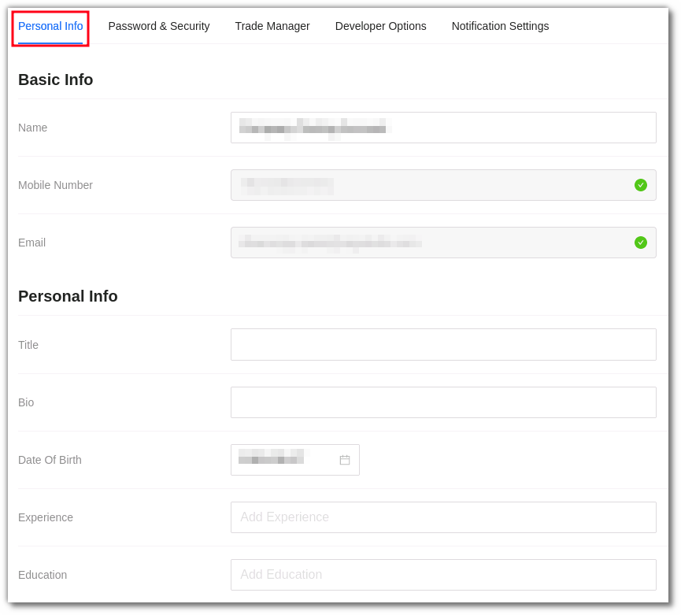
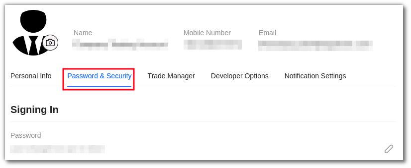
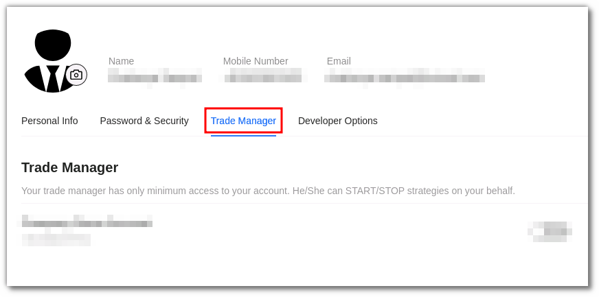
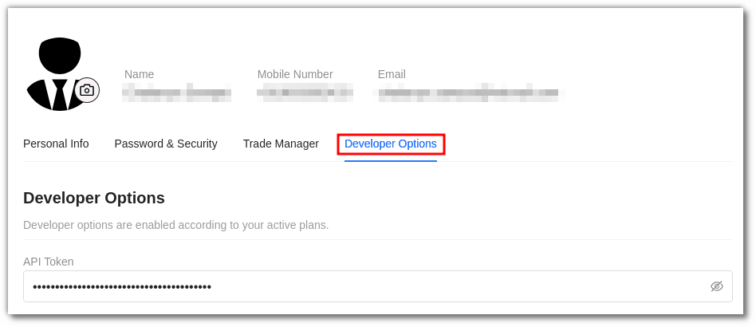

# Settings

## 1. Introduction

Add or edit your basic profile, set your trading risk, grant access to your trading manager, and explore your developer options.

### The settings section is divided into 4 parts: 

### i. Personal Info

You can add or edit your [personal details here](https://app.algobulls.com/settings?section=personalInfo).

**Basic Info:**

**Name**: Your **full name**, preferably, in accordance with a **legal document** such as an Aadhar Card.

**E-mail**: Your relationship manager or an AlgoBulls representative will reach out to you via email or phone.

**Mobile Number**: Your registered mobile number is displayed here. This field is non editable.

**Personal Info:**

**Title**: A suitable one liner description for your bio.

**Bio**: A short **about me** section that allows us to learn more about you and interact with you suitably.

**Date of Birth**: Set up your date of birth.

**Experience**: If we know the degree of your market knowledge, our experts will be able to connect with you more effectively over the phone/email.

**Education**: If we know whether you have any past financial background, our specialists will be able to connect with you more effectively over the phone/email. (For example, Commerce, MBA Finance, and so on.)

**Link Social Media Accounts:**

You can also link your social media accounts such as Linkedin, Twitter, Facebook, Instagram & YouTube.

### ii. Password & Security

You can [edit your password](https://app.algobulls.com/settings?section=password%26Security) and check other security options here .

### iii. Trade Manager

Enter your [agent's details here](https://app.algobulls.com/settings?section=tradeManager) if your AlgoBulls platform account will be managed by them.

!!! note annotate "Note"  

     * Please do not share your AlgoBulls credentials with your agent. Once you add your agent details here, the agent gets a separate set of credentials with limited account access to manage your trades.
   
     * AlgoBulls will not be responsible for any issues occurring because of deliberate or leaked credentials of your account.

### iv. Developer Options

We offer the Python Build service to the developers through our platform. Developers can use the [pyalgotrading](https://github.com/algobulls/pyalgotrading/)  package to create and test their own strategies. To learn more, visit the [Developer Options](../developers.md) help page.
