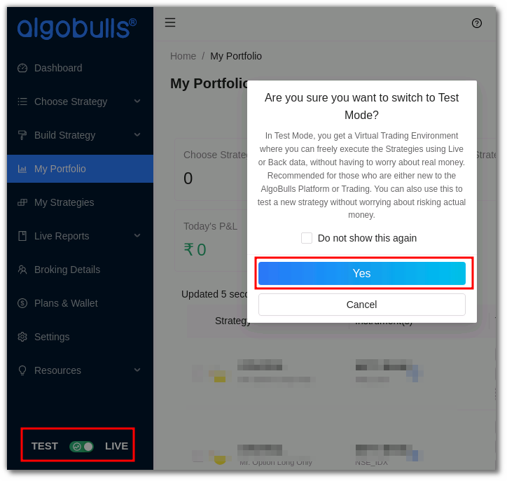
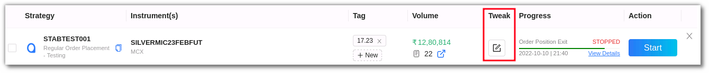
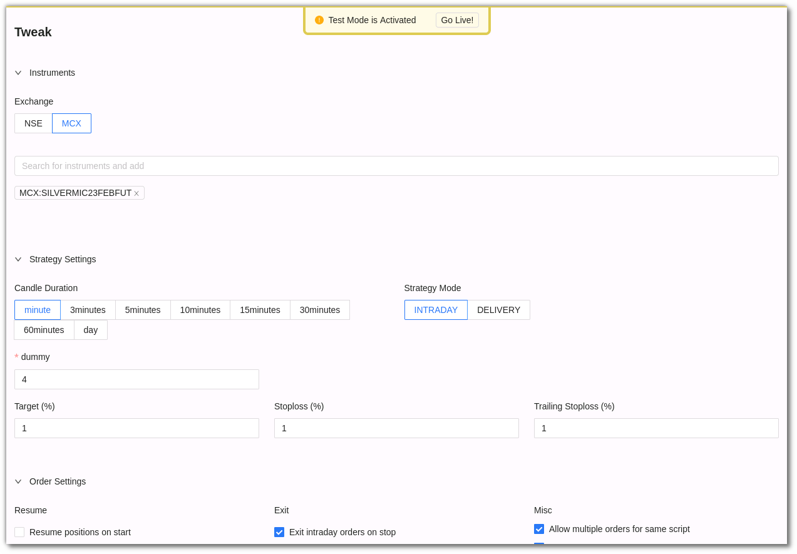
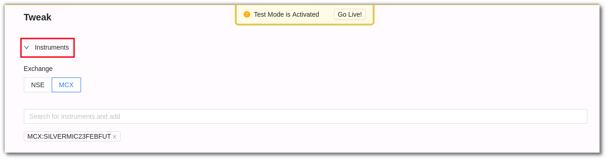
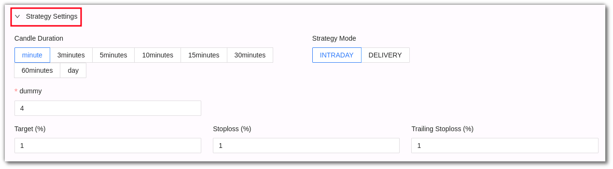
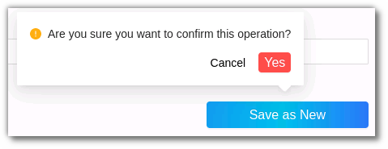
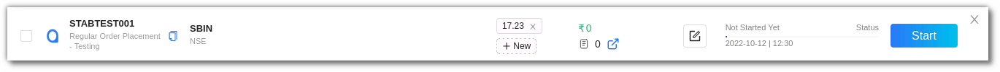

# Tweak

<iframe width="560" height="315" src="https://www.youtube.com/embed/E1CxSEgyjIg" frameborder="0" allow="accelerometer; autoplay; encrypted-media; gyroscope; picture-in-picture" allowfullscreen></iframe>

## 1. Introduction
If you'd like to tweak the strategies for **backtesting or paper trading**, AlgoBulls also has a **Tweak** option. 
Before entering the live markets, you can tweak different parameters of a strategy to see how they function and what results are generated

## 2. How to tweak a strategy?

**Step 1:** Before you tweak a strategy switch to the **test mode** on AlgoBulls. 

**Step 2:** To tweak a strategy, click the tweak button on the strategy.

**Step 3:** You can change the parameters as per your choice.

These parameters include **instrument, strategy settings** and **order settings** 
In the instrument parameter, you can select the **exchange or search the instrument** in the search bar

In strategy settings, you can select the **candle duration, strategy mode, target %, stop loss % and trailing stop loss**. 

In Order settings you can tweak **resume, exit & misc/miscellaneous** parameters. 
You can also add the **instrument max order count, crossover accuracy decimals & credit exposure factor**.

**Step 4:** Once you are convinced and happy with the tweak, click **save as new entry**. You will get a confirmation pop-up, click yes if you wish to continue.

A new entry will appear with the changes. You can see this entry in the [My Strategies](https://app.algobulls.com/manage-strategies) section.

You can also add tags to the tweaked strategy as per your requirement. 

## 3. How to apply the tweaked strategy in live trading? 

To know more about applying your tweaked strategy in the live markets, [click here](https://help.algobulls.com/member/virtual-trading.html#3-how-to-tweak-a-strategy-on-algobulls). 