# Virtual Trading

<iframe width="560" height="315" src="https://www.youtube.com/embed/n7b-OEZZxSc" frameborder="0" allow="accelerometer; autoplay; encrypted-media; gyroscope; picture-in-picture" allowfullscreen></iframe>

## 1. Introduction

The Test or Virtual trading mode is a virtual simulation of the real markets. Switch the toggle button on the bottom left side of the website to Test Mode. 

* Test any strategy in live markets without risking any money through Paper Trading. 
* Modify strategies using the Tweak option.
* Test past performance data for any strategy through Backtesting. 
* Choose a strategy from [Retail](https://app.algobulls.com/marketplace/category/retail), [Premium](https://app.algobulls.com/marketplace/category/premium) & [HNI marketplace](https://app.algobulls.com/marketplace/category/hni) now! 

Ensure the toggle button on the bottom left side of the website is switched to Test Mode.

[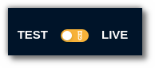](imgs/test_and_live4.png)

[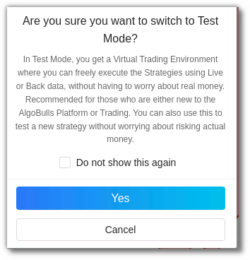](imgs/test_and_live2.png)

## 2. How to begin Virtual Trading?
---

You can backtest or paper trade on AlgoBulls in 4 simple steps. Before you begin, switch to the **Virtual/Test Mode** by using the toggle button on the bottom left side of the sidebar navigation.

[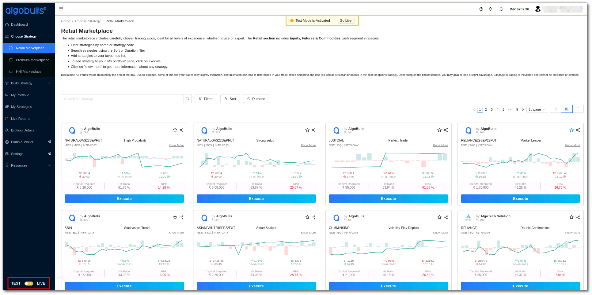](imgs/virtual_mode_retail_marketplace.png)

Also ensure that you’ve added a strategy from the [Choose Strategy](choose-strategy.md) marketplace by clicking on the **execute** button.

**Step 1**

In the [My Portfolio](live-trading.md) section click on the **Start** button in the Action column. 

[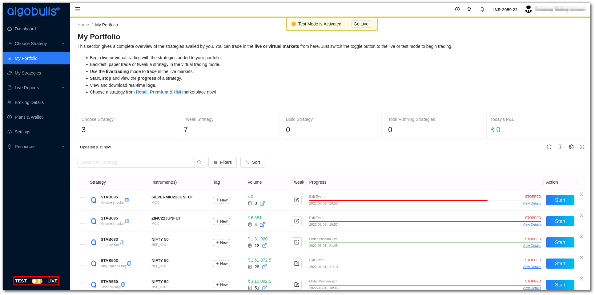](imgs/virtual_mode_my_portfolio.png)

A pop-up window will appear. The AlgoBulls **virtual broker** is the default broker selected in the **choose broker** option.

[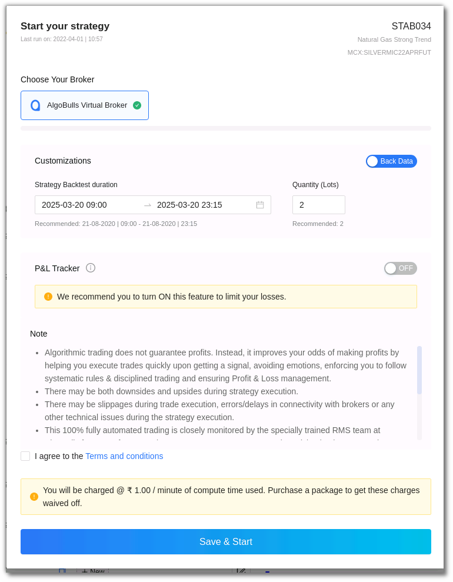](imgs/ptb5.png)

**Step 2**

In the **customizations** section choose **back data for backtesting** or **live data for paper trading**. 

[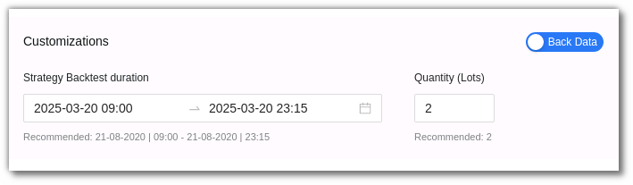](imgs/ptb6.png)

Select the duration option in the customizations section. Add the desired date and time, as well as the quantity/lots. In backtesting you will need to put the start date and end date along with time. 

[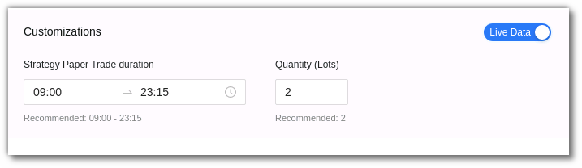](imgs/ptb7.png)

In paper trading you only need to add the start and end time. 

**Step 3**

Once you scroll below you will see the P&L tracker. Switch the P&L tracker **ON** and enter your desired profit and risk appetite. 

[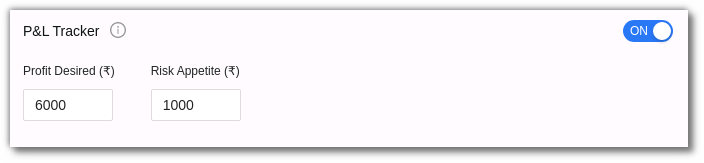](imgs/ptb8.png)

**Step 4**

Ensure you read the terms and conditions and then check the **I agree to the Terms and conditions** box. Save & Start the strategy.

[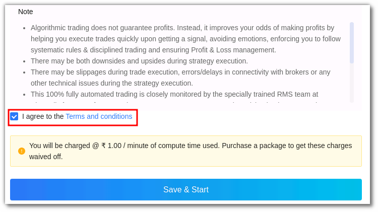](imgs/ptb9.png)

Please note that in both Backtesting and Paper Trading you will be charged if you don’t have an active AlgoBulls plan. To avoid these charges you can purchase an [AlgoBulls plan now](https://app.algobulls.com/wallet?defaultCategory=backtesting%26PaperTrading). 

You will be able to track the Backtesting or Paper Trading status in the Progress section.

[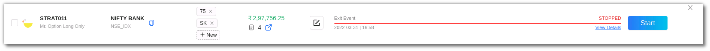](imgs/ptb10.png)

You can check the status details in the **view details** feature in the **progress** section. You can click on the **view detailed logs** option to get the **logs**. 

[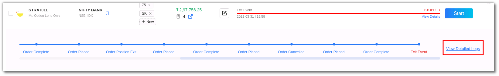](imgs/ptb11.png)

Once this process is complete, you will be able to view the strategy's **past performance** (Backtesting) or **live market performance** (Paper trading).

## 3. How to Tweak a Strategy on AlgoBulls?
---

If you'd like to tweak the strategies for Backtesting or Paper Trading , AlgoBulls also has a Tweak option. 

Before you tweak a strategy, switch to the Test Mode on AlgBulls.

To tweak a strategy, click the tweak button on the strategy. 

[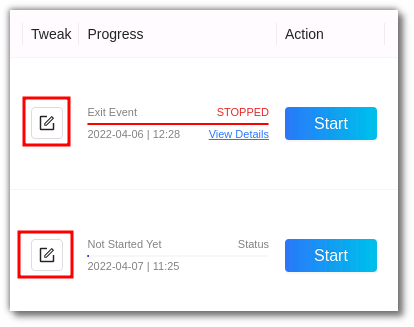 ](imgs/tweak2.png "Click to Enlarge or Ctrl+Click to open in a new Tab")

You can change the parameters as per your choice.

These parameters include **Instrument, Strategy Settings and Order Settings**.

In the instrument parameter, you can select the exchange or search the instrument in the search bar.

In strategy settings, you can select the **candle duration, strategy mode, target %, stop loss %** and **trailing stop loss**. 

In Order settings you can tweak **resume, exit & misc/miscellaneous** parameters. 

You can also add the **Instrument max order count, crossover accuracy decimals & credit exposure factor**.

Once you are convinced and happy with the tweak, click **save as new entry**. You will get a confirmation pop-up, click **yes** if you wish to continue. 

A new entry will appear with the changes. You can see this entry in the **My Strategies** section.

## 4. Summary Bar
---

The **summary bar** in the portfolio section includes the following: 

**Choose Strategy**: Number of strategies from the Marketplace in your portfolio added by you.

**Tweak Strategy**:  Number of strategies that have been tweaked by you.

**Build Strategy**: Number of custom strategies that have been built by the AlgoBulls developer team for you. 

**Total Running Strategies**: The number of strategies that are currently active on your portfolio, especially from the ones mentioned above (During the market hours).

**Today’s P&L**: The total P&L value.

## 5. Fields
---

My Portfolio includes the following fields: 

* **Strategy**: This field displays the strategy name and code.

* **Instrument(s)**: This includes the instrument on which the strategy is being run. 

* **Tag** - This is a user defined tag for the strategy. Users can tag different strategies under different tags.

* **Volume** - This includes the strategy volume. To get a detailed view you can also click the symbol highlighted in blue in the volume field that redirects you to the tradebook.

* **Tweak** - You can Tweak parameters and other configuration settings here. 
The strategy configuration field includes Instrument and Strategy Settings such as general settings, strategy parameters, resume, exit and misc options. 

* **Progress** - This includes the strategy progress status. You can view if the strategy is about to begin, has begun or has stopped here. You can also click on the view details section to get a real time progress update. 

* **Logs** - The log feature allows you to view the complete details of an order placed. In the **progress** field click on the **view details** option and then click  **detailed logs** on the right side corner. These logs can also be downloaded at any time of the day unless you override it by starting the same strategy again.

* **Action** - The action field allows you to start or stop a strategy. To execute a strategy click **start**. When you click on the start you will be able to choose multiple brokers and run the strategies simultaneously too.

## 6. Toolbar
---
The Dashboard toolbar includes the refresh, density, settings and full screen tools. 

**Refresh** - If you can't see an entry in the table (perhaps the most recent one), click Refresh to check again.

[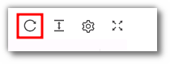](imgs/toolbar3.png)

**Density** - View data comfortably by choosing the density. The options include Larger, Middle and Compact. 

[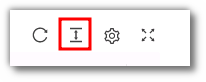](imgs/toolbar4.png)

**Settings** - Select the columns that you want to view in this settings option.

[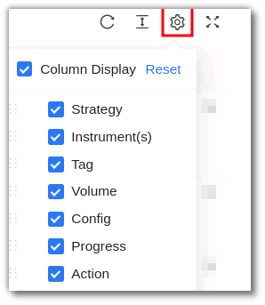](imgs/toolbar5_portfolio.png)

**Full Screen** - With this option you will be able to view your current tab on the browser in full Screen. To go back to the normal viewing mode click on it again. This is similar to pressing F11 on most browsers and operating systems.

[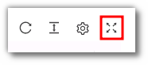](imgs/toolbar6.png)

