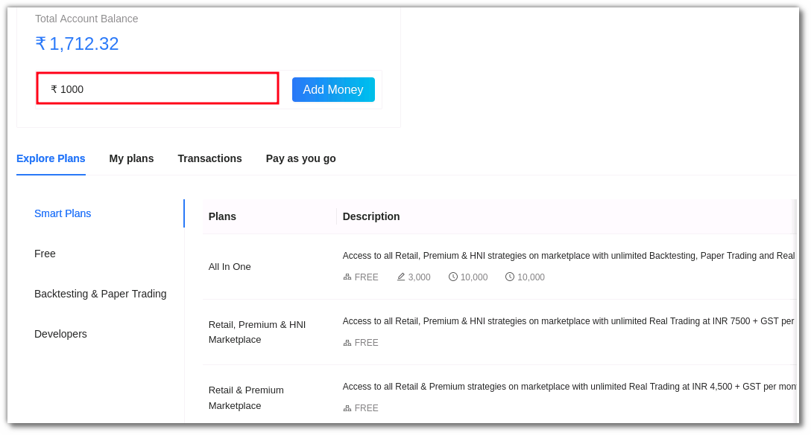
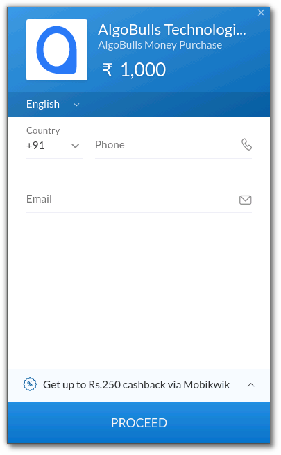
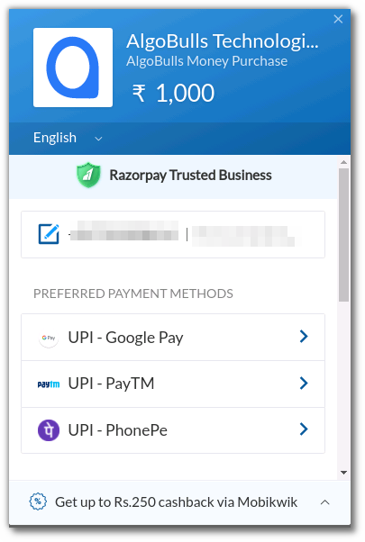
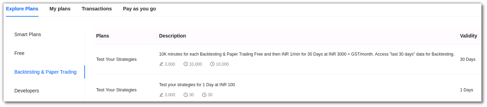

# Plans and Wallet

## 1. Introduction:
To begin trading with AlgoBulls, you must have a sufficient balance in your account. This sum can be deposited into your wallet via the **plans and wallet** page. Certain services that you use on AlgoBulls have charges involved, but to ensure that you can start trading without worrying about the charges, we have a range of plans that you can subscribe to.

Let’s understand how you can add money to your Algobulls wallet, subscribe to plans and use the pay-as-you-go model.

## 2. How to add money? 
To add money to your AlgoBulls account. Choose [Plans & Wallet](https://app.algobulls.com/wallet?defaultCategory=smartPlans) from the sidebar navigation. Enter the amount and click on **+ Add Money**.

Enter your **phone number & email address** and **click on proceed**.

Choose your preferred **payment method**. Once the payment is successful the balance will be added in your AlgoBulls account. 

All of your actions, such as backtesting, paper trading, and live trading, are charged depending on the amount in your wallet (wherever charges are applicable).

Your funds are reduced as you are charged, and when they reach zero, your account stops trading.

You can consider opting for [subscription plans](https://app.algobulls.com/wallet?defaultCategory=smartPlans) to get more cost-effective benefits.

Here’s a quick explainer on how you can subscribe to a package of your choice. 

## 3. How to subscribe to a plan?

To subscribe to a plan, you can choose a package of your choice from the plans & wallet section.

These plans are active for a specific time duration. Hence all services included in the package will not incur any additional charges for that period.

### Example

If you activate a smart plan in **Live Trading** for equity strategy services for 1180 INR for 30 days, you will be able to use the service without incurring any further expenses for the next 30 days.

If you wish to **backtest a strategy**, the subscription selected  by you does not include **virtual services**. This means **virtual trading services** will continue to be charged and you will have to subscribe to virtual trading plans or  pay-as-you-go to use these services. 

Ensure you keep a track of the usage costs by checking the [Fund Book](https://app.algobulls.com/book/fund). You can add money or subscribe to a plan from the Plans and Wallet section. 

AlgoBulls also offers a range of free plans: Try a [Free Plan](https://app.algobulls.com/wallet?defaultCategory=freehttps://app.algobulls.com/wallet?defaultCategory=free) now! 

Other services that you can use without any additional charges:  

* Adding a strategy from the Choose Strategy Marketplace.

* Viewing backtesting reports for a strategy from the Choose Strategy Marketplace.

* Tweaking (Change parameters of) a strategy. 

## 4. Subscription plans: 

### i. Plans 

A list of platform's available packages organised by category. The current category of plans include [Backtesting & Papertrading](https://app.algobulls.com/wallet?defaultCategory=backtesting%26PaperTrading), [Developers](https://app.algobulls.com/wallet?defaultCategory=developers), [Free](https://app.algobulls.com/wallet?defaultCategory=free), [Offers](https://app.algobulls.com/wallet?defaultCategory=offers) & [Smart Plans](https://app.algobulls.com/wallet?defaultCategory=smartPlans). 
Try our [free plan](https://app.algobulls.com/wallet?defaultCategory=free) now! 

### ii. Active Plans 

Plans that are active in your account currently. This includes the **category, validity, description, amount, purchase date and end date**. 

### iii. History 

A list of all the amounts you've added to your wallet in the past. This includes the **transaction ID, plan created & updated, status and amount**. 

To subscribe to a plan, click on the amount button for that plan. 

## 5. Pay As You Go Model: 

You are charged for various services that you use.This may include **backtesting, paper trading, tweaking** strategies and more. To keep track of the usage costs, always check your Fund Book in the live reports section. 

Did you know? You can try backtesting and paper trading for free too, subscribe to this [free plan to begin backtesting or paper trading](https://app.algobulls.com/wallet?defaultCategory=free) at no additional cost. (For the free minutes, post which you will be charged)

!!! note annotate "Note"
 
    * Backtesting and paper trading would be charged at a rate of ₹ 1 per minute (execution time)

### Example 

If you have been backtesting a strategy for the last two months and it takes 7 minutes to compile a backtesting report, you will only be charged for those 7 minutes. However, if you execute paper trading on a strategy from 9.15 AM to 3.15 PM, you will be charged for 360 minutes (6 hrs).

To know the **charges for Live Trading**, you have to check the **transaction fee (w/o package)** section in the strategy details as shown below: 

