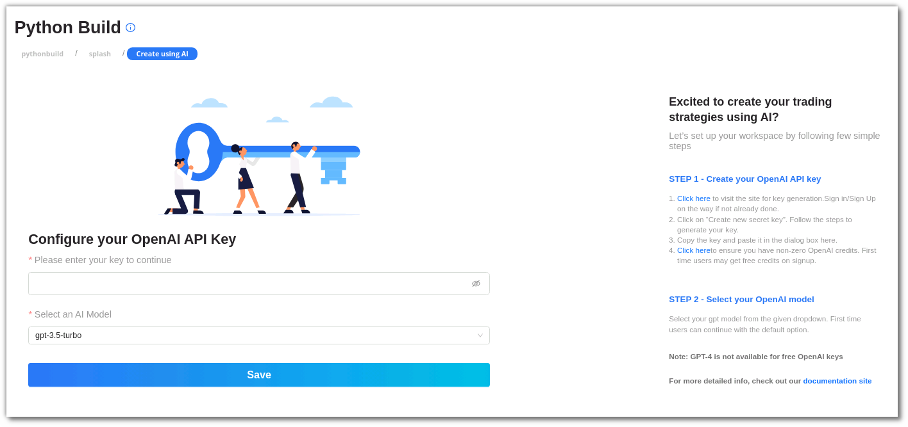
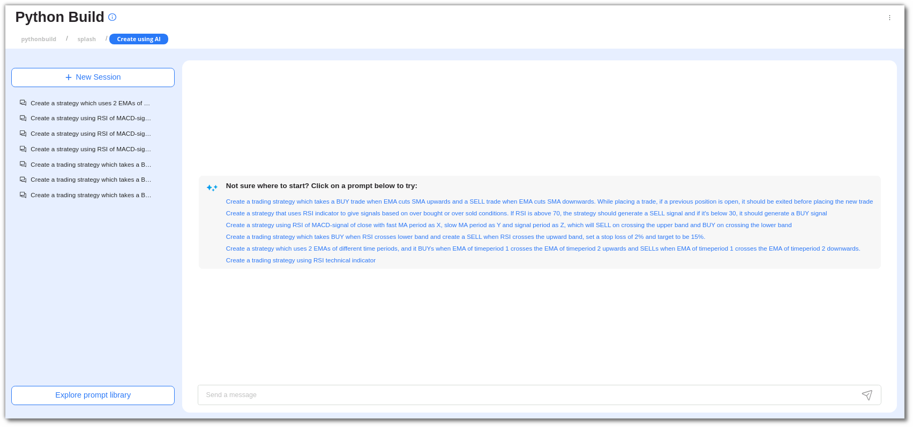
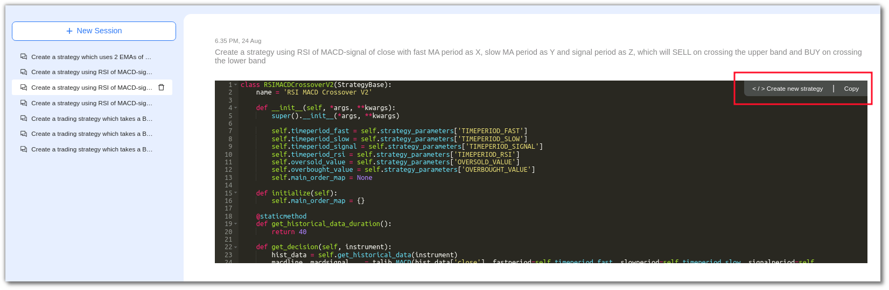

[//]: # (## How to Code a Strategy using Gen-AI)

If you have creative ideas in your mind and want to design a algotrading strategy but you are new at coding, don't worry, we have got it covered using our Python Build's **Create Using AI** feature which will help you to create trading strategies seamlessly.

[//]: # (To start with **Create using AI** feature, go to our Python Build page, there you will land on our splash page)
[//]: # ([![add-gen-ai-keys]&#40;imgs_v2/python_build_splash.png&#41;]&#40;imgs_v2/python-build-add-gen-ai-key.png&#41;)

You can check [here](../gen_ai/get_open_ai_keys.md) on how to get your Chat-GPT API key

## Set your Gen-AI API keys and Model
1. Once you have retrieved the API key, you need to paste it in the input box for API keys.  
2. Select the model of AI from the drop-down menu below.   
3. Click on the **Save** button to save your key and model and establish the connection.

    

## Enter your Prompts
1. On the left hand side you can see the previous sessions and chat history
2. Right below you will see a button for **Prompts Library** which has all the sample prompts that would generate wonderful strategies, you can pick any of them, if needed you can even tailor those prompts and use them.
3. To start a new session click on **New Session**
4. Enter your prompt or select from the sample prompts or take one prompt from the **Prompts Library**
5. Click on the send button to start generating

!!! info "Please Note, It takes some time to generate the strategy as it processes a lot of data, so please be patient"
    
   

## Save your Strategy
1. Once it gives you the strategy you can ask it to make more changes as per your need or you can save it directly.
2. To save, click on the top right corner of the code, you can even copy the code if you want.
3. Once you save it, it will redirect you to a new page where you have save your strategy and update its configuration parameters from the parameter settings.
4. All your saved strategies can be viewed in **My Coded Strategies** section in Python Build.
    
