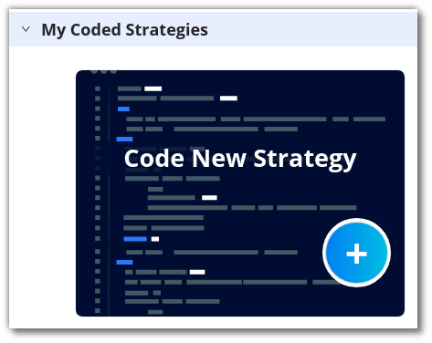
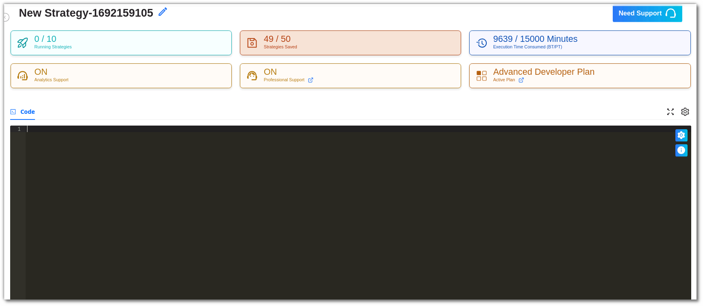

## How to code a new strategy?
---

If you want to create your own strategy, click on the **+ Sign** in the **Code New Strategy** option under the **My Coded Strategies** section.

A new blank code editor will open, allowing you to start coding your new strategy. You can check out the basic building blocks of a strategy [here](strategy_guides/structure.md){target=_blank} to help you with your code structure. After you've finished coding, click **Save** to save this strategy in the **My Coded Strategies** section.

!!!Tips "How to Code ?"
    To know more on how to code trading strategies and understand their format, click [here](strategy_guides/structure.md).
    We also have in detail explanation for [regular strategies](strategy_guides/common_regular_strategy.md) as well as [options strategies](strategy_guides/common_options_strategy.md).

Next, you need to configure the strategy’s parameters by clicking on the settings symbol in the top right corner of the code editor. In this section you can add, view & edit the strategy parameters.

To test the behavior and performance of the strategy, click on **Save & Start** and follow the directions given earlier. The performance of the strategy will soon be available in the **Results** section.

You can rename a strategy by clicking the edit symbol beside the strategy name. 

!!! Tips "What's Next ?"
    You can check out our strategy code structure and their respective formats for options and equity. Once you have verified that your strategy has no pythonic errors then you can move on to  [Configure and Execute your Strategy](python-build-config-parameters.md). 
