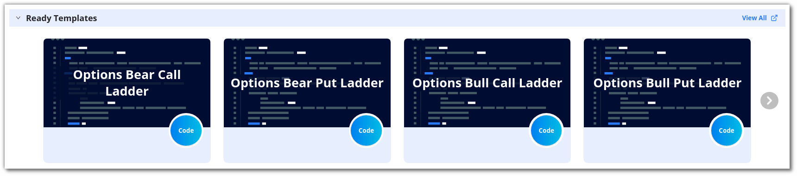
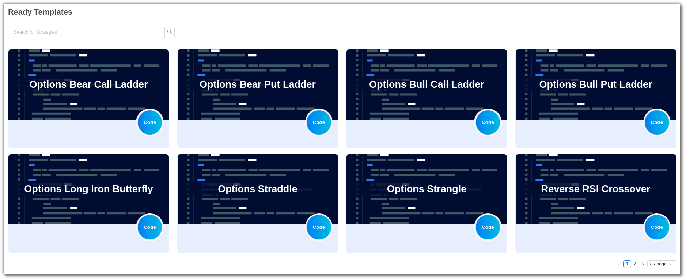
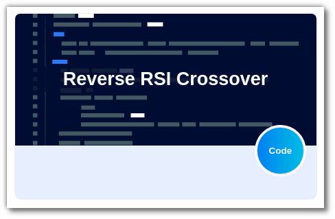

## How to code strategies using Ready Templates?

---

Select a template that you would like to modify from the **Ready Template** section. To view all the ready-to-use templates click on **[More](https://app.algobulls.com/build/python?key=samplestrategies)**.

Click on the **Code button** placed in the bottom right corner of the selected template to view the strategy code.

You should now see the **code editor**, where you can start modifying the code as required.

To save the strategy, click the Save button. This strategy will be added to your list of **My coded strategies**.

