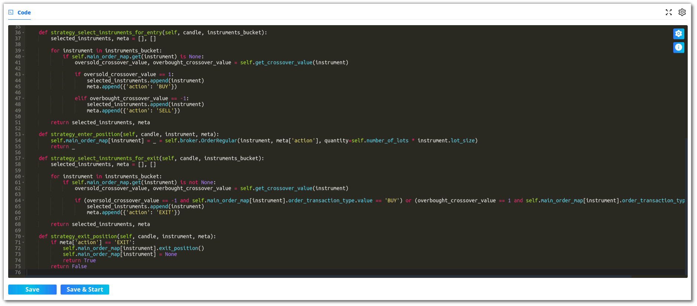

## How to code strategies using Ready Templates?

---

Select a template that you would like to modify from the **Ready Template** section. To view all the ready-to-use templates, click on **[More](https://app.algobulls.com/pythonbuild/MyAllStrategy?query=eyJTdHJhdGVneVR5cGUiOiJSZWFkeVRlbXBsYXRlIiwiY3VycmVudFBhZ2UiOjEsInBhZ2VTaXplIjo4fQ%3D%3D){target=_blank}**.

Click on the **Code button** placed in the bottom right corner of the selected template to view the strategy code.

You should now see the **code editor**, where you can start modifying the code as required.

!!!Tips "Modify your code ?"
    To know more on how to code trading strategies and understand their format, click [here](strategy_guides/structure.md).
    We also have in detail explanation for [regular strategies](strategy_guides/common_regular_strategy.md) as well as [options strategies](strategy_guides/common_options_strategy.md).

To save the strategy, click the Save button. This strategy will be added to your list of **My coded strategies**.

!!! Tips "What's Next ?"
    You can check out our strategy code structure and their respective formats for options and equity. Once you have verified that your strategy has no pythonic errors then you can move on to  [Configure and Execute your Strategy](python-build-config-parameters.md). 
