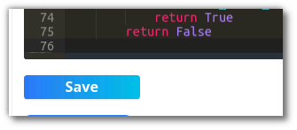
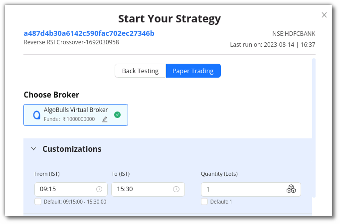

## How to code strategies using Ready Templates?

---

Select a template that you would like to modify from the **Ready Template** section. To view all the ready-to-use templates click on **[More](https://app.algobulls.com/build/python?key=samplestrategies)**.

Click on the **Code button** placed in the bottom right corner of the selected template to view the strategy code.

You should now see the **code editor**, where you can start modifying the code as required.

To save the strategy, click the Save button. This strategy will be added to your list of **My coded strategies**.

Follow these simple steps to test the strategy's performance

**Step 1**

After clicking **Save & Start**, a pop-up window will appear.

**Step 2**

In the **customizations** section choose **Backtesting** to back test or **Paper Trading** to Paper Trade a strategy.

Select the duration option in the customizations section. Add the desired date and time, as well as the quantity/lots. In Backtesting you will need to put the start date and end date along with time.

In Paper Trading you only need to add the start and end time.

**Step 3**

Once you scroll below, you will see the P&L tracker. Switch the P&L tracker ON and enter your desired profit and risk appetite. To keep things simple, you can also leave it turned off.

**Step 4**

In the Configuration section, you can check the parameters added or modified by you.
 
**Step 5**

To begin testing the strategy, click on Execute.

**Step 6**

Go to the **Results** section to see how the strategy has performed.

!!! note "Note:" 

    The use of Backtesting/Paper Trading is limited to one month. This would be available from Monday - Friday (excluding NSE holidays) from 9 AM to 11:30 PM. You can code your strategy & analyse the strategy results 24x7.

You can **rename** a strategy by clicking the edit symbol besides the strategy name.

!!! note "Note:" 
    The Analytics & Graph sections are only visible to premium plan users. If you are using a free plan, switch to a [premium developer plan now](https://app.algobulls.com/wallet/checkout?packageType=PackageCombo&plan=5&type=buy-new-plan).
