---
## Configure Strategy Parameters

[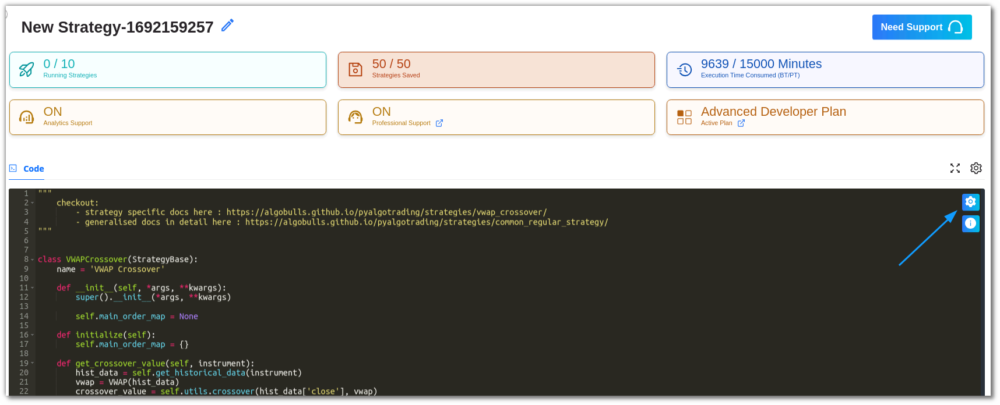](imgs_v2/python_build_new_strategy_parameters.png)

You can configure the strategy’s parameters by clicking on the settings symbol in the top right corner of the code editor. In this section, you can view a strategy’s parameters or edit these parameters too.

To know more about the parameters, [click here](https://help.algobulls.com/member/tweak.html){target=_blank}.

[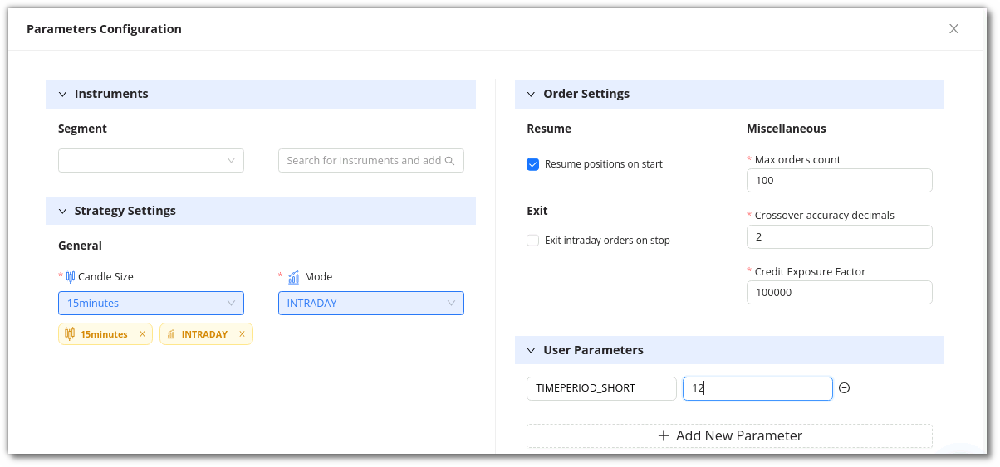](imgs_v2/python_build_edit_configuration.png)

**User Parameters:** In this section, you can customize/create your own parameters for the strategy. Click on **+Add New Parameter** to begin adding them. They should match with the parameters you have defined in your Python class.

Once Strategy and User Parameters are configured, you can follow these steps to execute your strategy.

## Follow these simple steps to test the strategy's performance

**Step 1**

After clicking **Save & Start**, a pop-up window will appear.

[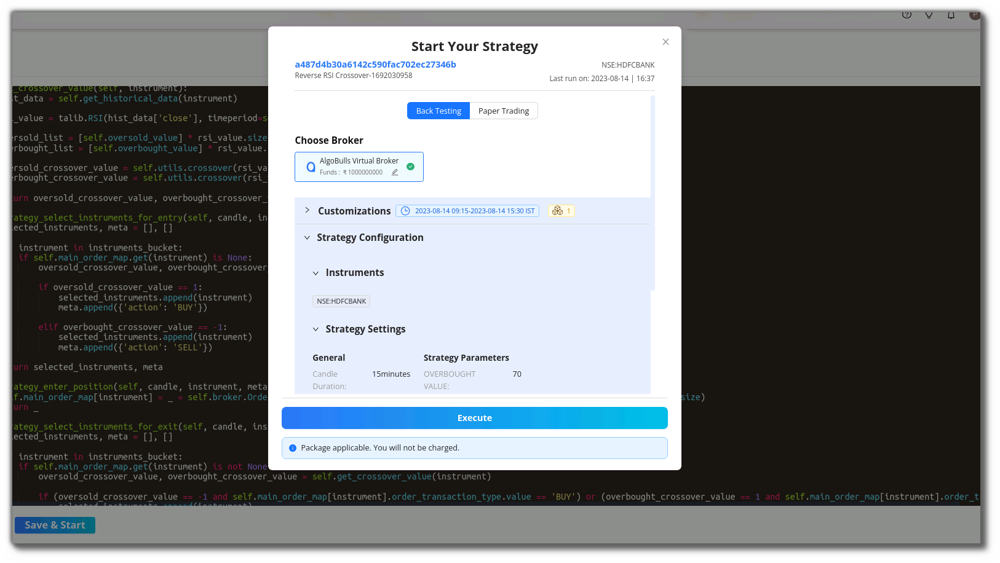](imgs_v2/python_build_save_and_start.png)

**Step 2**

In the **customizations** section, choose **Backtesting** to backtest or **Paper Trading** to Paper Trade a strategy.

Select the duration option in the customizations section. Add the desired date and time, as well as the quantity/lots. In Backtesting, you will need to put the start date and end date along with time.

In Paper Trading, you only need to add the start and end time.

[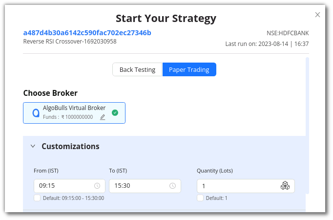](imgs_v2/python_build_papertesting.png)

**Step 3**

In the **Strategy Configuration** section, you can check the parameters added or modified by you.
 
**Step 4**

To begin testing the strategy, click on Execute.

[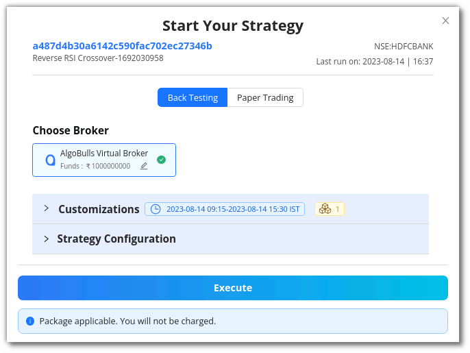](imgs_v2/python_build_terms_check.png)

**Step 5**

Go to the **Analytics** section to see the returns and performance of the strategy visualized.

!!! note "Note:" 

    The use of Backtesting/Paper Trading is limited to one month. This would be available from Monday - Friday (excluding NSE holidays) from 9 AM to 11:30 PM. You can code your strategy & analyze the strategy results 24x7.

[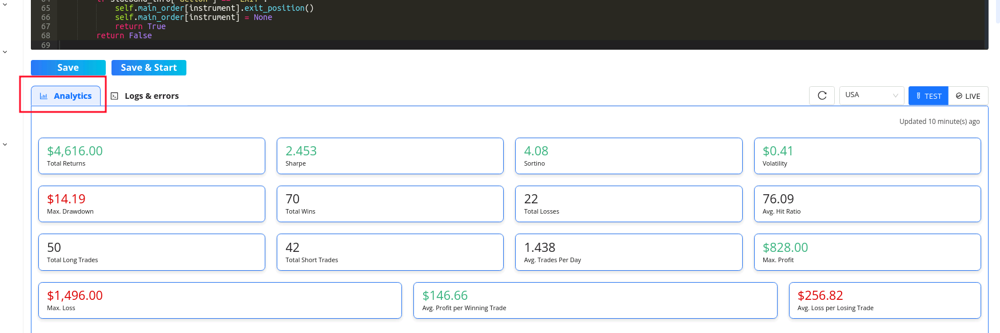](imgs_v2/python_build_results.png)

[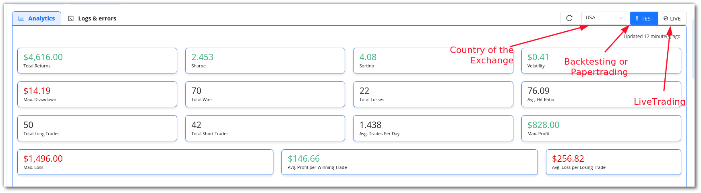](imgs_v2/python_build_stats.png)

[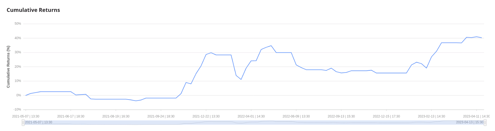](imgs_v2/python_build_cummulative_return_plot.png)

[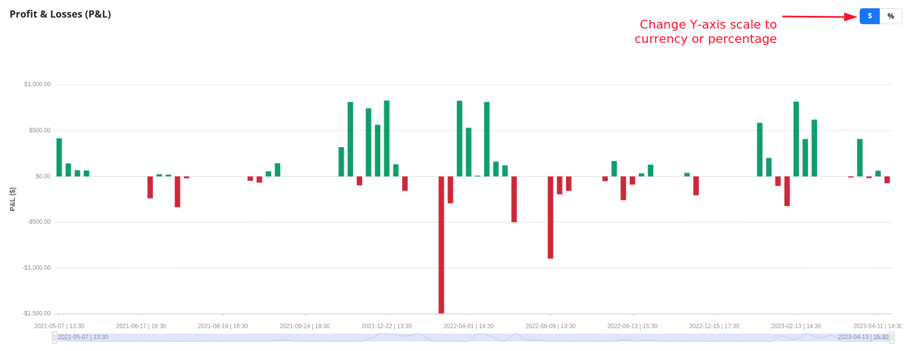](imgs_v2/python_build_pnl_bar_chart.png)

[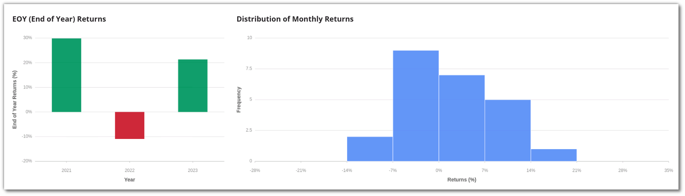](imgs_v2/python_build_eoy_monthly_returns_histogram.png)

[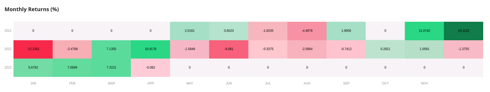](imgs_v2/python_build_monthly_returns_heatmap.png)

[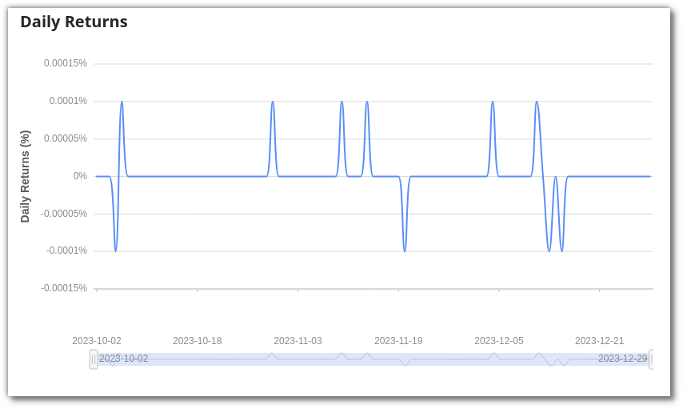](imgs_v2/python_build_daily_returns.png)

[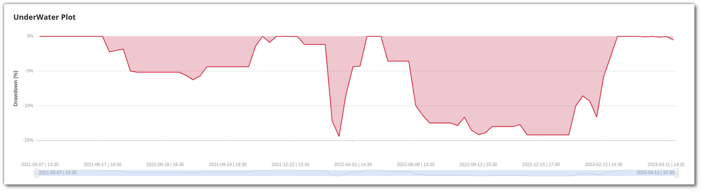](imgs_v2/python_build_daily_returns.png)

[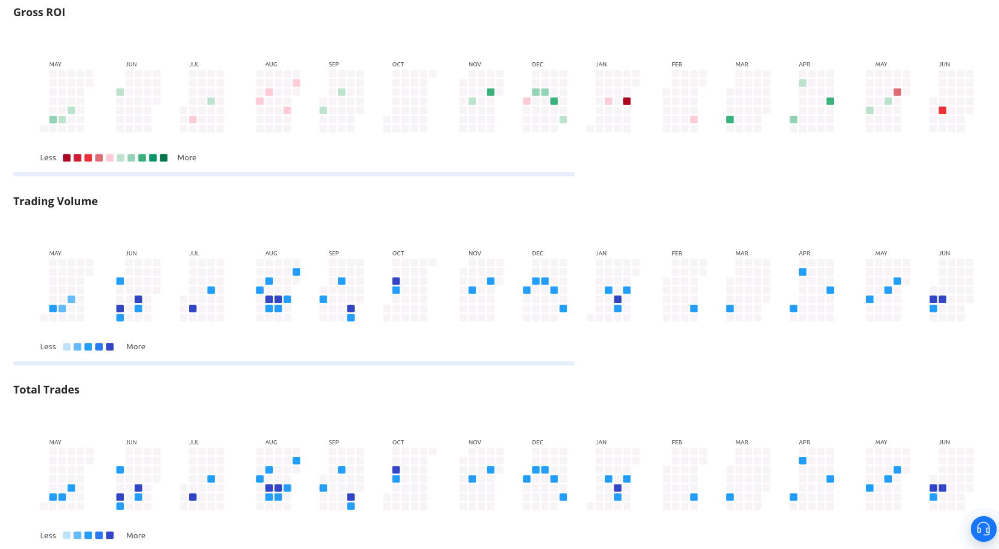](imgs_v2/python_build_roi_volume_trades_heatmap.png)

[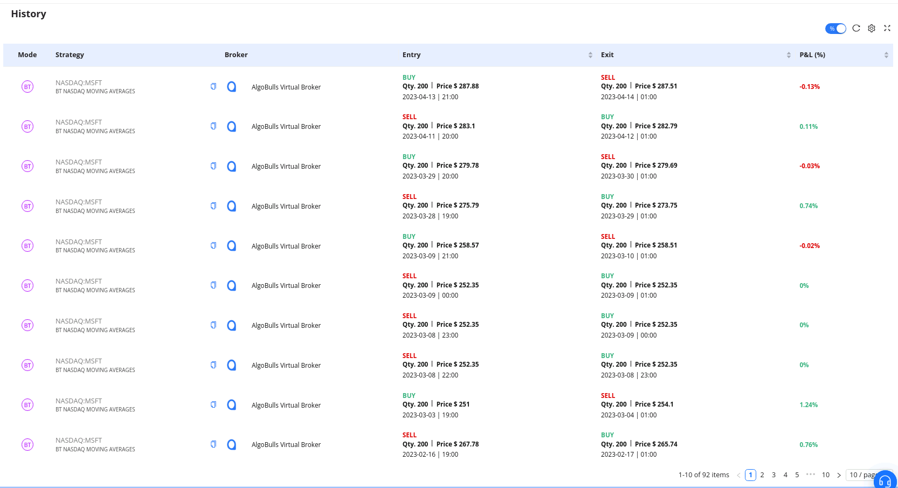](imgs_v2/pnl_history.png)

Go to the **Logs** section to see the step-by-step execution of the strategy in logs.

[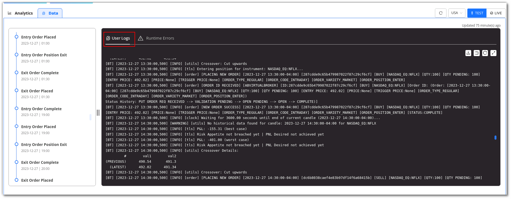](imgs_v2/python_build_user_logs.png)

[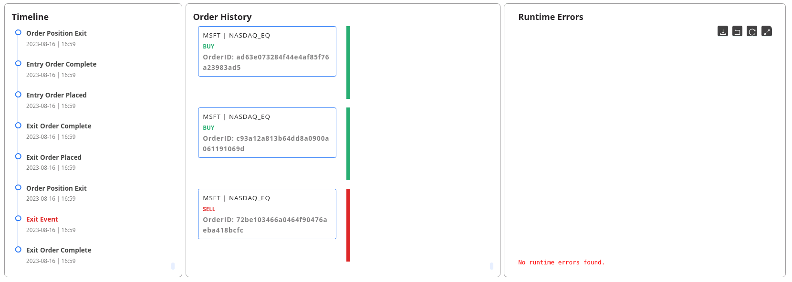](imgs_v2/python_build_order_history.png)

You can **rename** a strategy by clicking the edit symbol beside the strategy name.

[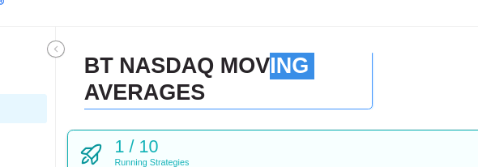](imgs_v2/python_build_strategy_rename.png)
