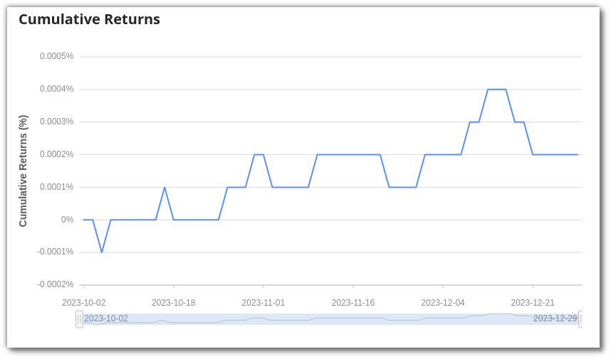
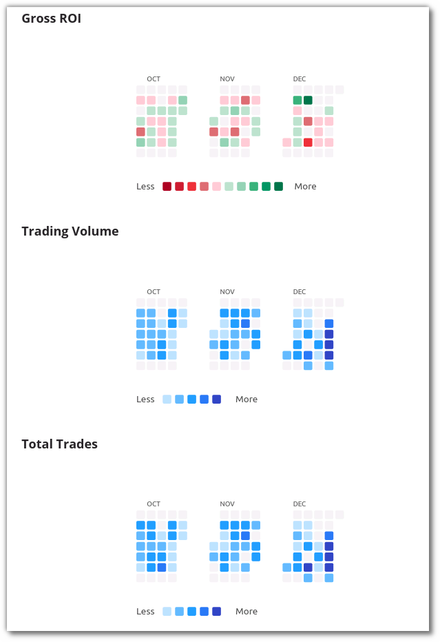
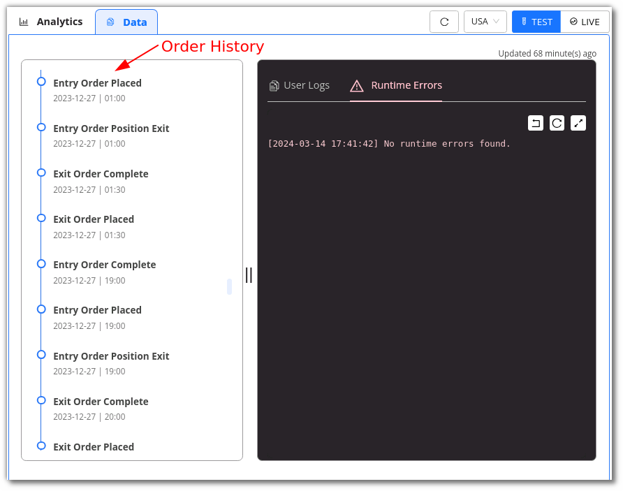
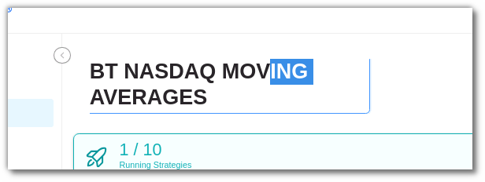

To effectively use pyalgotrading and make the most of your trading strategy, it's essential to be familiar with some frequently used stock market terminologies. Let's go over these terms before diving into configuring your strategy parameters.

1. **Exchange**: An exchange is a marketplace where various financial instruments like securities, commodities, and derivatives are traded. Examples include NSE (National Stock Exchange), BSE (Bombay Stock Exchange), NYSE (New York Stock Exchange), and NASDAQ.
2. **Instruments**: Instruments are the specific assets or securities traded on these exchanges. These include stocks like AAPL (Apple Inc.), TSLA (Tesla, Inc.), TATAMOTORS (Tata Motors Limited), and SBIN (State Bank of India).
3. **Candlestick** Charts: Candlestick charts are commonly used in stock market analysis. They represent the opening and closing prices of a stock or asset over regular time intervals, which are often referred to as "candle size."
4. **Intraday** Trading: Intraday trading, also known as day trading, involves buying and selling stocks within the same trading day.
5. **Delivery** Trading: Delivery trading is a type of trading where traders buy shares and hold them for an extended period, which can range from a few days to several months or even years.
6. **Position**: A position refers to the amount of a security or asset owned (or sold short) by an individual or entity. Traders take positions when they make buy or sell orders.
7. **Order**: An order is an instruction to buy or sell a security or asset on a trading venue, such as a stock market or cryptocurrency exchange.
8. **Crossover**: A crossover occurs when two signal lines intersect. Signal lines can be various indicators like moving averages, Relative Strength Index (RSI), Volume Weighted Averages, etc. Crossovers are often used to trigger and place orders.
Now that we've covered these essential terms, let's move on to configuring your trading strategy parameters.

## Configure Strategy Parameters

You can configure the strategy’s parameters by clicking on the settings symbol in the top right corner of the code editor. In this section, you can view a strategy’s parameters or edit these parameters too.

There 4 sections for configuring your parameters:

### Instruments
- Here you can select the allowed exchanges from the drop box given on the left (eg: **NASDAQ**, **NYSE**, **NSE** etc.)
- Once you have selected the exchange you can search the instrument in the search-box right beside it

### Strategy Settings
- Here you can select the candle size, it is the size of candle on which you are running your strategy is going to be executed
- You can even select the mode i.e. **INTRADAY** or **DELIVERY**

### Order Settings
- You can adjust your orders, on how they will act when the strategy is 'Resumed' or strategy is 'Exited'
- **Resume Positions from Start**: If you have previous trades in your strategy, you can resume your strategy without deleting or overwriting them. Only applicable for DELIVERY mode.
- **Exit Intraday Orders on Stop**: If checked, strategy will square-off positions automatically at the end of each trading day.
- **Max Order Count**: Maximum number of orders your strategy will execute per day. Once this limit is completed for the day, all BUY/SELL signals for new orders would be automatically ignored.
- **Crossover Accuracy Decimal**: When running a crossover strategy, the number of decimals of the underlying indicators to be taken do decide an upward cut, downward cut or no cut.
- **Credit Exposure Factor**: Applicable only for Live Trading. Use this to set the exposure limit given by your broker. System will take available funds as 'current fund balance X credit exposure factor' for executing the strategy

### User Parameters
- Use this option to pass various values of the strategy parameters from outside, without changing the code base for every execution. They are accessible as a dictionary called `strategy_parameters` inside  your strategy class' constructor method.
- You can customize/create your own parameters for the strategy. Click on **+Add New Parameter** to begin adding them. They should match with the parameters you have defined in your Python class.

Once Strategy and User Parameters are configured, you can follow these steps to execute your strategy.

[//]: # (To know more about the parameters, [click here]&#40;https://help.algobulls.com/member/tweak.html&#41;{target=_blank}.)

## Follow these simple steps to test the strategy's performance

**Step 1**

After clicking **Save & Start**, a pop-up window will appear.

**Step 2**

In the **customizations** section, choose **Backtesting** to backtest or **Paper Trading** to Paper Trade a strategy.

Select the duration option in the customizations section. Add the desired **date** and **time**, as well as the **quantity**/**lots**. In Backtesting, you will need to put the start date and end date along with time.

In Paper Trading, you only need to add the start and end **time**.

**Step 3**

In the **Strategy Configuration** section, you can check the parameters added or modified by you.

 

**Step 4**

To begin testing the strategy, click on Execute.

**Step 5**

Go to the **Analytics** section to see the returns and performance of the strategy visualized.

!!! note "Note:"
    The use of Paper Trading would be available from Monday - Friday (excluding exchange's holidays) from 9 AM to 16:00 PM. You can code your strategy & analyze the strategy results 24x7.

Go to the **Logs** section to see the step-by-step execution of the strategy in logs.

You can **rename** a strategy by clicking the edit symbol beside the strategy name.

