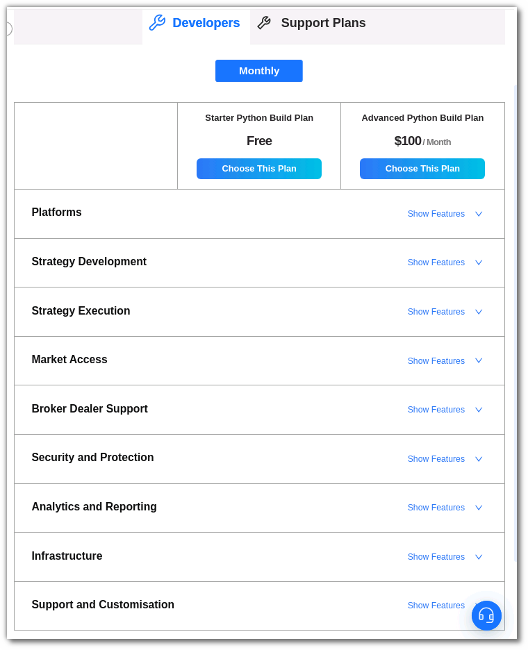

## How to get started with Python Build?

---

To start developing your own strategy, you must first activate a plan from the **[Pricing](https://build.algobulls.com/pricing?section=Smart%20Plans){target=_blank}** section. Select the **[Developers](https://build.algobulls.com/pricing?section=Developers){target=_blank}** tab in the **Pricing** section and select a plan of your choice.

* **Advanced Python Build Plan**: Develop your own Algorithmic Trading Strategy along with Analytics support, concurrent Strategy Executions, Professional Support, and more.

After selecting your plan, you will be able to begin coding. You can either edit the preloaded **Ready templates** or use the **Code from Scratch** section to create your own strategies.
