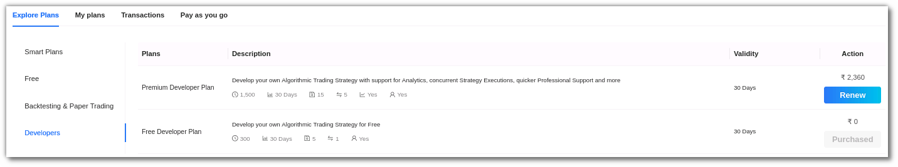

## How to get started with Python Build?

---

To start developing your own strategy, you must first activate a plan from the **[Plans & Wallet](https://app.algobulls.com/wallet)** section. Select the **[Developers](https://app.algobulls.com/wallet?category=Developers)** option in the **Explore Plans** section and select a plan of your choice. There are currently two developer plans available:

* **Premium Developer Plan**: Develop your own Algorithmic Trading Strategy with Analytics support, concurrent Strategy Executions, Professional Support, and more.

* **Free Developer Plan**: Develop your own Algorithmic Trading Strategy for Free.

After selecting your preferred plan, you will be able to begin coding. You can either edit the preloaded **Ready templates** or use **My Coded Strategies** section to create your own strategies
