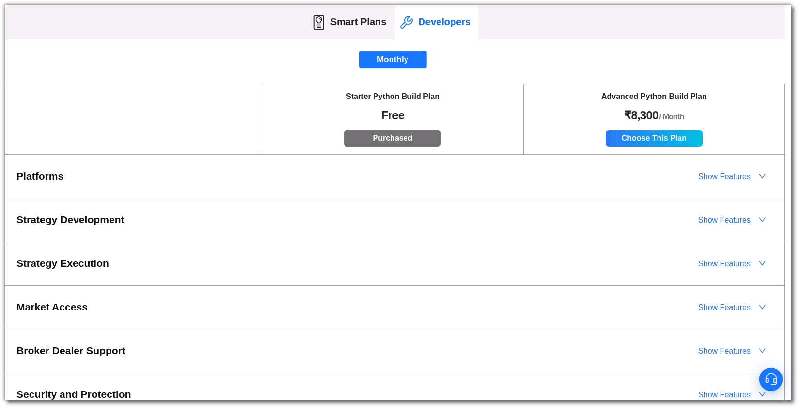
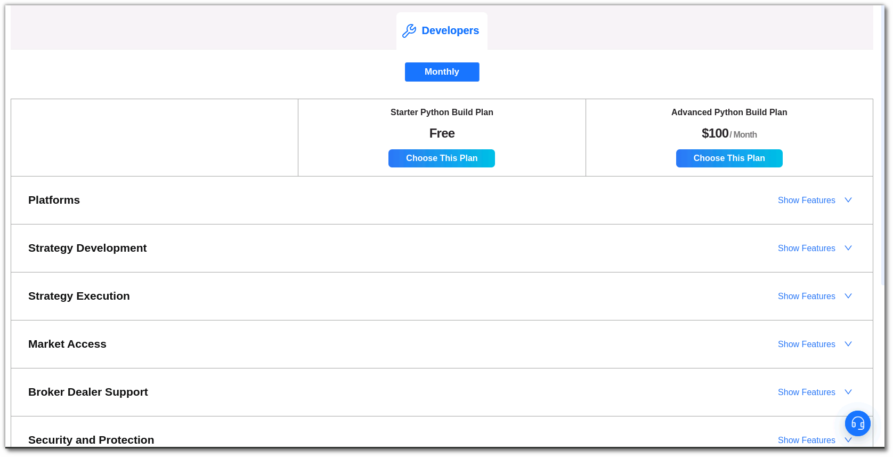

## How to get started with Python Build?

---

To begin developing your own strategy, you need to activate a plan from the  **[Pricing](https://app.algobulls.com/pricing?section=Smart%20Plans){target=_blank}** section. Choose from the available options:

### Starter Python Build Plan:
    
- Allows live trading only in the US market.
- Offers a set of features for developing Algorithmic Trading Strategies.
- Allows up to 50 strategies to be saved.
- Provides an execution time of 10,000 minutes for backtesting/paper trading.
- Allows a maximum of 10 strategies to run in parallel.

### Advanced Python Build Plan:

- Allows live trading in both US and Indian markets.
- Offers a set of features for developing Algorithmic Trading Strategies.
- Allows up to 200 strategies to be saved.
- Provides an execution time of 30,000 minutes for backtesting/paper trading.
- Allows a maximum of 20 strategies to run in parallel.
    
   **Python Build Plan for India**
    
   **Python Build Plan for US**
    

To start coding:

- Once you've selected your plan, you can start coding. Access the "Python Build Splash Screen" to explore various options, including "Code from Scratch" for creating your strategies.