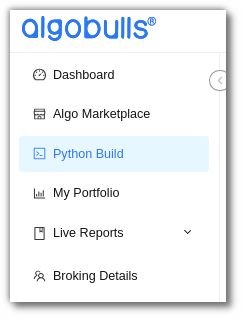
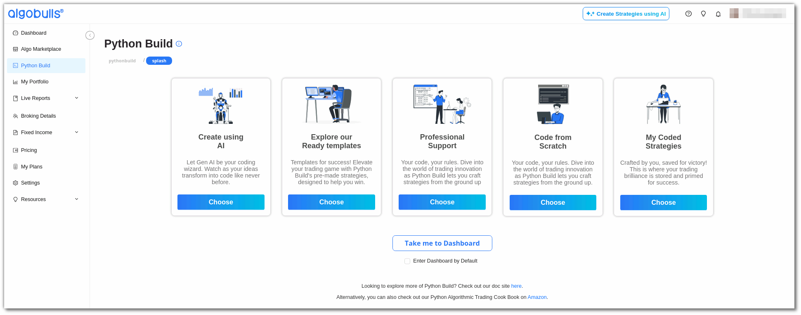
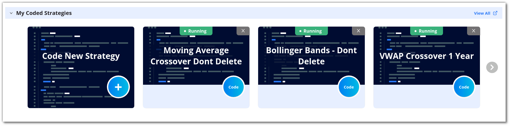
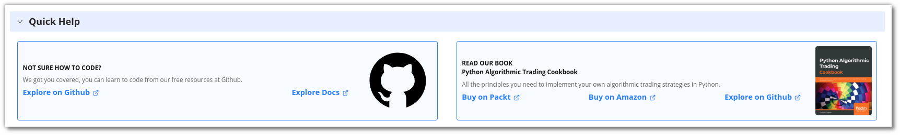

# Python Build Web

## Introduction

---

Now you can code your own strategy easily using our Python Build service! Begin coding your own strategy from scratch, or modify some of our ready-made templates to suit your needs. Get access to our state-of-the-art AlgoBulls Core Trading Engine, which automatically leverages our infrastructure so that you can access the latest historical data to gauge the performance of your strategies. Tweak the various parameters of your strategy to choose the ideal instrument, indicator values, and profit loss percentages as per your needs! View the performance of your strategy using our visual analytics feature and continue to tweak until you are satisfied with the performance. Get your strategy approved for live trading from our experts and deploy it on 30+ supported brokers without coding any broker integration logic.

Select **[Python Build](https://app.algobulls.com/build/python){target=_blank}** from the navigation bar on the left to know more.

## An overview

---

**Running Strategies:** This section shows how many strategies are currently active and running in your account. 

**Strategies Saved:** This displays the number of strategies saved in your AlgoBulls account. It also shows the number of maximum strategies that you can save as per your current plan. 

**Execution Time Consumed:** You can view the number of minutes that have been used for Backtesting or Paper Trading your strategies.

!!! note "Note:"

    Paper Trading would be available from Monday - Friday (excluding NSE/NASDAQ holidays) within the trading time of that particular exchange. You can code your strategy, execute on Backtesting mode or analyse the strategy results 24x7.
 
**Analytics Support:** This shows whether your analytics support is active. Analytics support is not available to free plan users.

**Professional Support:** This section connects you to other professional support forums for additional support while developing the strategy. 

**Active Plan:** This section displays the current plan active on your AlgoBulls account. 

**Ready Templates:** Ready-to-use templates that you can modify and test.

**My Coded Strategies:** Strategies that have been coded and saved by you are displayed here. This includes new and modified strategies developed by you.

**Quick Help:** Resources to help you code better.

