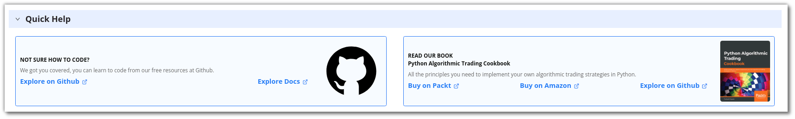

## An overview

---

**Running Strategies:** This section shows how many strategies are currently active and running in your account. 

**Strategies Saved:** This displays the number of strategies saved in your AlgoBulls account. It also shows the number of maximum strategies that you can save as per your current plan. 

**Execution Time Consumed:** You can view the number of minutes that have been used for Backtesting or Paper Trading your strategies.

!!! note "Note:"

    The use of Backtesting/Paper Trading is limited to one month. This would be available from Monday - Friday (excluding NSE holidays) from 9 AM to 11:30 PM. You can code your strategy & analyse the strategy results 24x7.
 
**Analytics Support:** This shows whether your analytics support is active. Analytics support is not available to free plan users.

**Professional Support:** This section connects you to other professional support forums for additional support while developing the strategy. 

**Active Plan:** This section displays the current plan active on your AlgoBulls account. 

**Ready Templates:** Ready-to-use templates that you can modify and test.

**My Coded Strategies:** Strategies that have been coded and saved by you are displayed here. This includes new and modified strategies developed by you.

**Quick Help:** Resources to help you code better.

