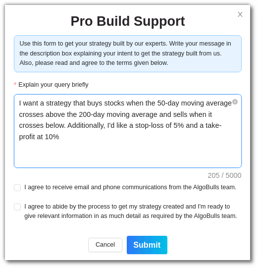

# Phoenix Professional Support

## Are you an Experienced Trader with Limited Coding Experience?

If you're an experienced trader who excels at building trading strategies based on technical analysis but lacks the coding expertise to implement them, Phoenix offers you the perfect solution – our Phoenix Professional Support.

## How Can Phoenix Professional Support Help You?

Our Phoenix Professional Support bridges the gap between your market expertise in technical analysis and our proficiency in coding and algo trading strategy development. We understand that not everyone is a coding wizard, and that's where our professional support comes in.

## Getting Started

To take advantage of our Phoenix Professional Support, follow these simple steps:

1. **Click on "Professional Support"** - Look for the "Professional Support" button on the **Phoenix Web** splash and click on it to get started.
   

2. **Describe Your Strategy** - Once you're in the professional support interface, you'll be prompted to describe your trading strategy. You can provide details on how you want your strategy to work, including entry and exit criteria, risk management rules, and any specific requirements you have.

     *Sample Prompt*: "I want a strategy that buys stocks when the 50-day moving average crosses above the 200-day moving average and sells when it crosses below. Additionally, I'd like a stop-loss of 5% and a take-profit at 10%."

     

3. **Indicate Technical Indicators** - Specify which technical indicators you want to use in your strategy. You can mention indicators like moving averages, RSI, MACD, or any others that are crucial for your trading approach.

4. **Submit Your Request** - Once you've filled in the necessary information, click on the "Submit" button. Your request will be sent to our professional support team.

## What Happens Next?

Our dedicated professional support team will promptly review your request. They will connect with you to gather any additional details if needed and ensure they have a clear understanding of your requirements.

Our team of experienced Python developers and algo trading experts will then get to work on implementing your strategy according to your specifications. We'll ensure that your strategy is coded efficiently and effectively, leveraging the power of Phoenix.

You can expect to receive your custom-coded trading strategy as soon as possible, allowing you to put your trading expertise to work without the coding hassle.

With Phoenix's Professional Support, you can confidently bring your trading ideas to life and stay ahead in the competitive world of stock market trading. Start automating your strategies today!
