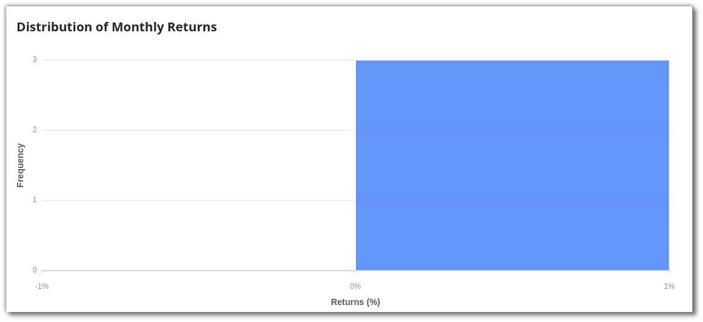
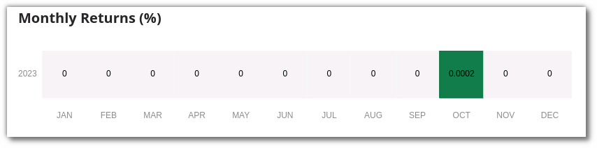

## How to view the Results?

----

Once you start the strategy, it may take a while for it to complete the execution. You can switch to the **Analytics** tab after you run your strategy. Even if the strategy execution is not complete, you will still see intermediate results.

**Analytics:** In the analytics section, you can view a strategy’s Stats & various other metrics in the form of graphs like P&L.

#### Stats
In this section you can see the **total returns, sharpe ratio, sortino ratio, volatility, Max Drawdown, Total wins or Loses, Total short or long trades, hit ratio, number of trades, average trades per day, max profit, max loss, average profit per winning trade, average loss per losing trade**.

#### Cumulative Returns

#### Profit & Loss (Currency or %)
The trade by trade P&L in Currency or Percentage.

#### End of Year Returns Plot (%)

#### Monthly Returns Histogram (%)

#### Monthly Returns Heatmap (%)

#### Daily Returns (%)

#### Underwater Drawdown Plot (%)

#### P&L Book
View detailed trade by trade report. Premium users can analyze this data in the form of heatmaps for Gross Profit & Loss, Trading Volume & Total number of Trades.

#### User Log
Real-time logs from strategy execution are displayed in this section. Use these logs to debug your strategy’s behavior and performance.

#### Order History
View the order state transition for every order placed by your strategy in-depth.

#### P&L Table
View comprehensive trade-by-trade report in a user-friendly tabular format. This table provides details on entry and exit trades, prices, timestamps, transaction types, and trade-by-trade profit and loss. You can display these figures in either percentages or dollars.

