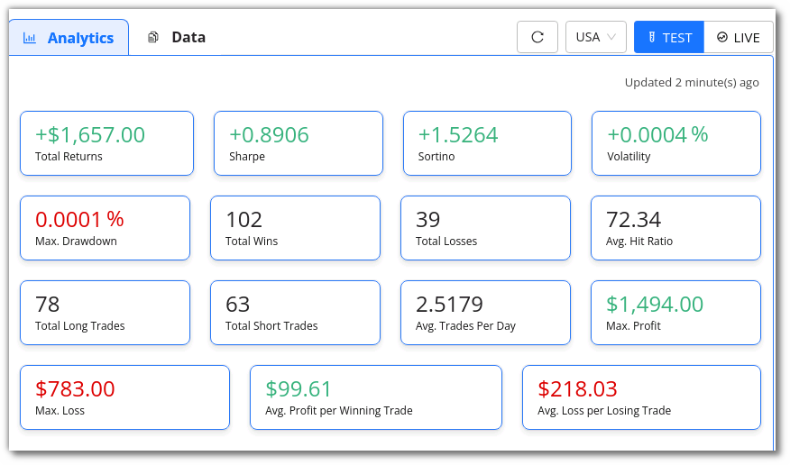
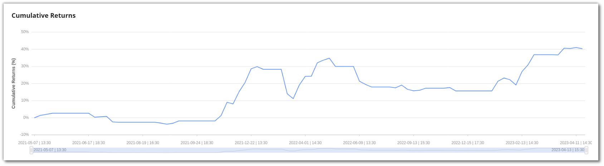

## How to view the Results?

----

Once you start the strategy, it may take a while for it to complete the execution. You can Switch to the Results tab after you run your strategy.  Even if the strategy execution is not complete, you will still see intermediate results.

Only Premium developer plans users will be able to view the strategy analytics values & graphs.

[//]: # (**Statistics:** In the statistics section, you can view a strategy’s Stats & various other metrics in the form of graphs like P&L and ROI.)
**Analytics:** In the analytics section, you can view a strategy’s Stats & various other metrics in the form of graphs like P&L.

#### Stats
In this section you can see the **total returns, sharpe ratio, sortino ratio, volatility, Max Drawdown, Total wins or Loses, Total short or long trades, hit ratio, number of trades, average trades per day, max profit, max loss, average profit per winning trade, average loss per losing trade**.

#### Cummulative Returns

#### Profit & Loss (Currency or %)
The trade by trade P&L in Currency or Percentage.

#### End of Year Returns Plot (%)

#### Monthly Returns Histogram (%)

#### Monthly Returns Heatmap (%)

#### Daily Returns (%)

#### Underwater Drawdown Plot (%)

[//]: # (iv. ROI &#40;INR&#41;: Cumulative P&L of all the trades.)

[//]: # ()
[//]: # ([![pythonbuild]&#40;imgs/python_build_roi_inr.png "Click to Enlarge or Ctrl+Click to open in a new Tab"&#41;]&#40;imgs/python_build_roi_inr.png&#41;)

[//]: # (**v. ROI%:** You will be able to view the ROI in percentage here.)

[//]: # ()
[//]: # (![pythonbuild]&#40;imgs/python_build_roi_percent.png&#41;)

[//]: # ([**iv. The Graph Tool**]&#40;https://help.algobulls.com/member/strategy-card.html#6-graph-tool&#41;)

[//]: # ()
[//]: # ([![pythonbuild]&#40;imgs/python_build_graph_tool_2.png "Click to Enlarge or Ctrl+Click to open in a new Tab"&#41;]&#40;&#41;)

#### P&L Book
View detailed trade by trade report. Premium users can analyse this data in the form of heatmaps for Gross Profit & Loss, Trading Volume & Total number of Trades.

#### User Log
Real time logs from strategy execution are displayed in this section. Use these logs to debug your strategy’s behaviour and performance.

#### Order History
View the order state transition for every order placed by your strategy in depth. 

