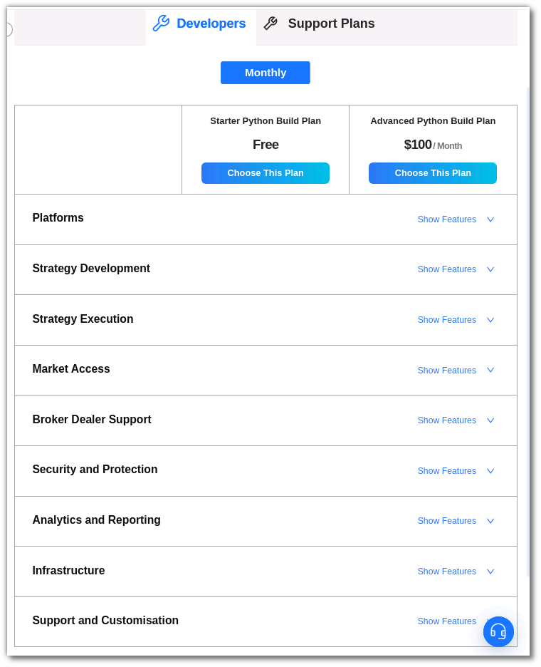
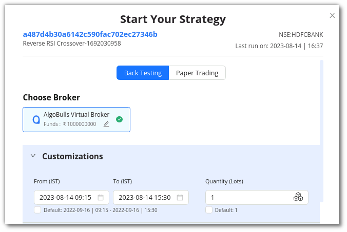
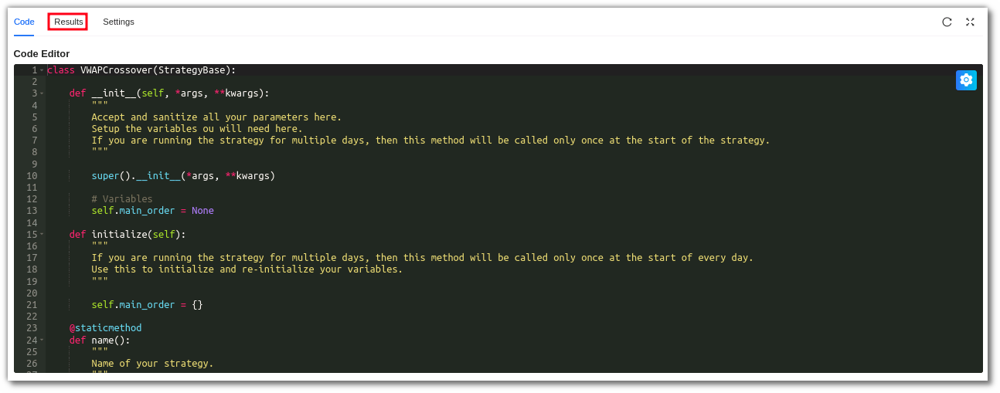
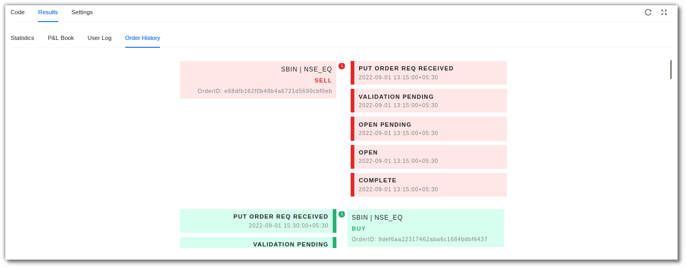
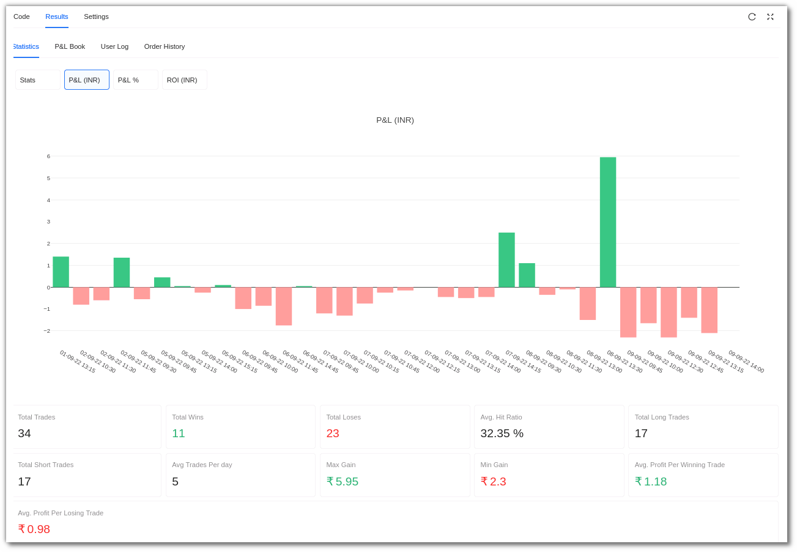
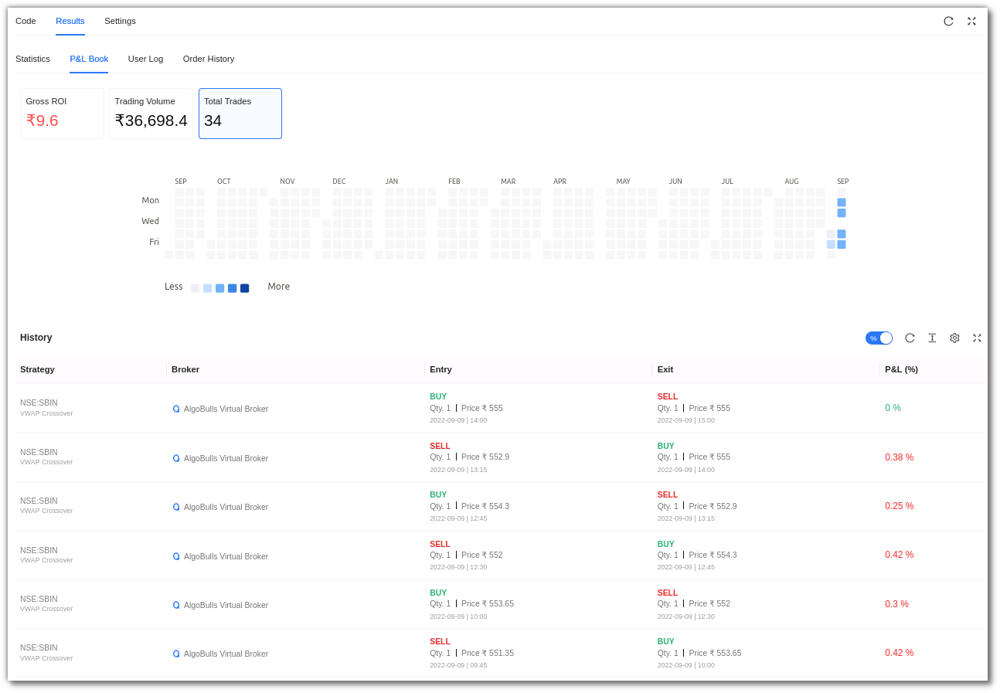
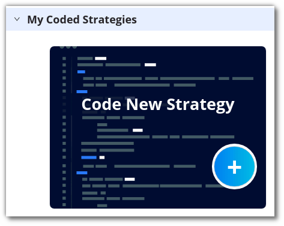

# Python Build

## 1. Introduction
---

Now you can code your own strategy easily using our Python Build service! Begin coding your own strategy from scratch, or modify some of our ready-made templates to suit your needs. Get access to our state-of-the-art AlgoBulls Core Trading Engine, which automatically leverages our infra so that you can access the latest historical data to gauge the performance of your strategies. Tweak the various parameters of your strategy to choose the ideal instrument, indicator values, and profit loss percentages as per your needs! View the performance of your strategy using our visual analytics feature and continue to tweak till you are satisfied with the performance. Get your strategy approved for live Trading from our experts and deploy it on 30+ supported brokers without coding any broker integration logic.

Go to **Build Strategy** in the sidebar navigation and select **[Python Build](https://app.algobulls.com/build/python){target=_blank}** to know more.

## 2. An overview
---

**Running Strategies:** This section shows how many strategies are currently active and running in your account. 

**Strategies Saved:** This displays the number of strategies saved in your AlgoBulls account. It also shows the number of maximum strategies that you can save as per your current plan. 

**Execution Time Consumed:** You can view the number of minutes that have been used for Backtesting or Paper Trading your strategies.

!!! note "Note:"

    The use of Backtesting/Paper Trading is limited to one month. This would be available from Monday - Friday (excluding NSE holidays) from 9 AM to 11:30 PM. You can code your strategy & analyse the strategy results 24x7.
 
**Analytics Support:** This shows whether your analytics support is active. Analytics support is not available to free plan users.

**Professional Support:** This section connects you to other professional support forums for additional support while developing the strategy. 

**Active Plan:** This section displays the current plan active on your AlgoBulls account. 

**Ready Templates:** Ready-to-use templates that you can modify and test.

**My Coded Strategies:** Strategies that have been coded and saved by you are displayed here. This includes new and modified strategies developed by you.

**Quick Help:** Resources to help you code better.

## 3. How to get started with Python Build?
---

To start developing your own strategy, you must first activate a plan from the **[Plans & Wallet](https://app.algobulls.com/wallet){target=_blank}** section. Select the **[Developers](https://app.algobulls.com/wallet?category=Developers)** option in the **Explore Plans** section and select a plan of your choice. There are currently two developer plans available:

* **Premium Developer Plan**: Develop your own Algorithmic Trading Strategy with Analytics support, concurrent Strategy Executions, Professional Support, and more.

* **Free Developer Plan**: Develop your own Algorithmic Trading Strategy for Free.

After selecting your preferred plan, you will be able to begin coding. You can either edit the preloaded **Ready templates** or use **My Coded Strategies** section to create your own strategies

## 4. How to code strategies using Ready Templates?
---

Select a template that you would like to modify from the **Ready Template** section. To view all the ready-to-use templates click on **[More](https://app.algobulls.com/build/python?key=samplestrategies)**.

Click on the **Code button** placed in the bottom right corner of the selected template to view the strategy code.

You should now see the **code editor**, where you can start modifying the code as required.

To save the strategy, click the Save button. This strategy will be added to your list of **My coded strategies**.

Follow these simple steps to test the strategy's performance

**Step 1**

After clicking **Save & Start**, a pop-up window will appear.

**Step 2**

In the **customizations** section choose **Backtesting** to back test or **Paper Trading** to Paper Trade a strategy.

Select the duration option in the customizations section. Add the desired date and time, as well as the quantity/lots. In Backtesting you will need to put the start date and end date along with time.

In Paper Trading you only need to add the start and end time.

**Step 3**

Once you scroll below, you will see the P&L tracker. Switch the P&L tracker ON and enter your desired profit and risk appetite. To keep things simple, you can also leave it turned off.

**Step 4**

In the Configuration section, you can check the parameters added or modified by you.
 
**Step 5**

To begin testing the strategy, click on Execute.

**Step 6**

Go to the **Results** section to see how the strategy has performed.

!!! note "Note:" 

    The use of Backtesting/Paper Trading is limited to one month. This would be available from Monday - Friday (excluding NSE holidays) from 9 AM to 11:30 PM. You can code your strategy & analyse the strategy results 24x7.

You can **rename** a strategy by clicking the edit symbol besides the strategy name.

!!! note "Note:" 
    The Analytics & Graph sections are only visible to premium plan users. If you are using a free plan, switch to a [premium developer plan now](https://app.algobulls.com/wallet/checkout?packageType=PackageCombo&plan=5&type=buy-new-plan).

## 5. How to view the Results?
----

Once you start the strategy, it may take a while for it to complete the execution. You can Switch to the Results tab after you run your strategy.  Even if the strategy execution is not complete, you will still see intermediate results.

Only Premium developer plans users will be able to view the strategy analytics values & graphs.

[//]: # (**Statistics:** In the statistics section, you can view a strategy’s Stats & various other metrics in the form of graphs like P&L and ROI.)
**Statistics:** In the statistics section, you can view a strategy’s Stats & various other metrics in the form of graphs like P&L.

i. Stats: In this section you can see the **hit ratio, number of trades, average trades per day**.

ii. P&L (INR):  The trade by trade P&L in INR.

iii. P&L %: The trade by trade P&L in percentage form.

[//]: # (iv. ROI &#40;INR&#41;: Cumulative P&L of all the trades.)

[//]: # ()
[//]: # ([![pythonbuild]&#40;imgs/python_build_roi_inr.png "Click to Enlarge or Ctrl+Click to open in a new Tab"&#41;]&#40;imgs/python_build_roi_inr.png&#41;)

[//]: # (**v. ROI%:** You will be able to view the ROI in percentage here.)

[//]: # ()
[//]: # (![pythonbuild]&#40;imgs/python_build_roi_percent.png&#41;)

[**iv. The Graph Tool**](https://help.algobulls.com/member/strategy-card.html#6-graph-tool)

v. P&L Book: View detailed trade by trade report. Premium users can analyse this data in the form of heatmaps for Gross Profit & Loss, Trading Volume & Total number of Trades.

vi. User Log:  Real time logs from strategy execution are displayed in this section. Use these logs to debug your strategy’s behaviour and performance.

vii. Order History: View the order state transition for every order placed by your strategy in depth. 

## 6. How to code a new strategy?
---

If you want to create your own strategy, click on the **+ Sign** in the **Code New Strategy** option under the **My Coded Strategies** section.

A new blank code editor will open, allowing you to start coding your new strategy. You can check out the basic building blocks of a strategy [here](https://algobulls.github.io/pyalgotrading/structure/) to help you with your code structure. After you've finished coding, click **Save** to save this strategy in the **My Coded Strategies** section.

Next, you need to configure the strategy’s parameters by clicking on the settings symbol in the top right corner of the code editor. In this section you can add, view & edit the strategy parameters.

To test the behaviour and performance of the strategy, click on **Save & Start** and follow the directions given earlier. The performance of the strategy will soon be available in the **Results** section.

You can rename a strategy by clicking the edit symbol besides the strategy name. 

## 7. How to Configure Strategy Parameters?
---

You can configure the strategy’s parameters by clicking on the settings symbol in the top right corner of the code editor. In this section you can view a strategy’s parameters or edit these parameters too.

To know more about the parameters, [click here](https://help.algobulls.com/member/tweak.html).

**User Parameters:** In this section, you can customize/create your own parameters for the strategy. Click on **+Add New Parameter** to begin adding them. They should match with the parameters you have defined in your Python class.
