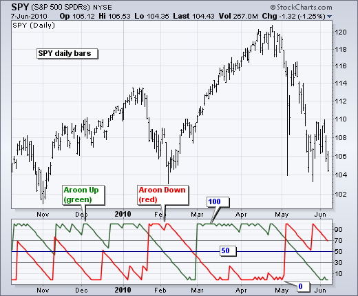

# Aroon Crossover 
This is a trading strategy called "Aroon Crossover" implemented in Python using the PyAlgoTrading library. The strategy is based on the Aroon indicator crossover.

!!! Links
    - **[Strategy Code (.py)](https://github.com/algobulls/pyalgostrategypool/blob/master/pyalgostrategypool/aroon_crossover/_strategy.py){target=_blank}**
    - **[Strategy Structure (common methods used in a regular and options strategy)](strategy_guides/common_strategy_guide.md){target=_blank}**

!!! Tips "Jupyter Notebooks for Indian Exchange (NSE)"
    - **[Click here to view a working notebook for NSE exchange in cloud. No installation required. ](https://nbviewer.org/github/algobulls/pyalgotrading/blob/master/jupyter/nse_equity/aroon_crossover.ipynb){target=_blank}**
    - **[Click here to execute a working notebook for NSE exchange in cloud. No installation required. ](https://mybinder.org/v2/gh/algobulls/pyalgotrading/master?labpath=https%3A%2F%2Fgithub.com%2Falgobulls%2Fpyalgotrading%2Fblob%2Fmaster%2Fjupyter%2Fnse_equity%2Faroon_crossover.ipynb){target=_blank}**

!!! Tips "Jupyter Notebook for US Exchange (NASDAQ)"
    - **[Click here to view a working notebook for NASDAQ exchange in cloud. No installation required. ](https://nbviewer.org/github/algobulls/pyalgotrading/blob/master/jupyter/nasdaq_equity/aroon_crossover_us.ipynb){target=_blank}**
    - **[Click here to execute a working notebook for NASDAQ exchange in cloud. No installation required. ](https://mybinder.org/v2/gh/algobulls/pyalgotrading/master?urlpath=lab%2Ftree%2Fjupyter%2Fnasdaq_equity%2Faroon_crossover_us.ipynb){target=_blank}**

## Aroon Indicator
- In the stock market, Aroon refers to the Aroon indicator, which is a technical analysis tool used to measure the strength and direction of a trend. It consists of two lines, the Aroon-Up line and the Aroon-Down line.

- The Aroon-Up line measures the number of periods since the highest price within a given period, while the Aroon-Down line measures the number of periods since the lowest price within a given period. The Aroon indicator ranges from 0 to 100, with values closer to 100 indicating a strong trend and values closer to 0 indicating a weak or non-existent trend.

- Traders and investors use the Aroon indicator to identify potential trend reversals, assess the strength of a trend, and generate buy or sell signals. For example, when the Aroon-Up line crosses above the Aroon-Down line, it may suggest a bullish trend, while a cross below may indicate a bearish trend.

- It is important to note that the Aroon indicator is just one of many tools used in technical analysis, and its effectiveness can vary depending on market conditions and other factors. It is often used in conjunction with other indicators and analysis techniques to make informed trading decisions.

|     |
|: -- :|
| <b>Fig.1 - SPY candle chart (top), Aroon Indicator for that chart (bottom)</b>|

## Strategy Overview
This strategy, called Aroon Crossover, implements a crossover strategy using the Aroon indicator. It generates entry and exit signals based on the crossover of Aroon Up and Aroon Down values.

## Strategy Parameters
The following parameters can be configured for the strategy:

| Name            |  Default Value  | Expected Value                                                    | Description                                       |
|:----------------|:---------------:|:------------------------------------------------------------------|:--------------------------------------------------|
| **TIME_PERIOD** |      None       | greater than 0                                                    | The period for which we calculate the Aroon Value |

## Crossover Calculation

The `get_crossover_value` method calculates the Aroon Up and Aroon Down values for a given instrument based on the historical data. It uses the `talib.AROON` function from the Talib library to calculate the values. The method then determines the crossover of Aroon Up and Aroon Down and returns the corresponding entry or exit action.
