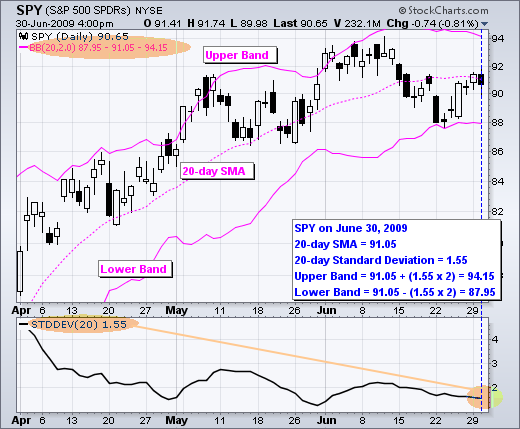

# Bollinger Bands 

This is a trading strategy called "Bollinger Bands" implemented in Python using the PyAlgoTrading library. The strategy is based on the bollinger bands indicator values.

!!! Links
    - **[Strategy Code (.py)](https://github.com/algobulls/pyalgostrategypool/blob/master/pyalgostrategypool/bollinger_bands.py){target=_blank}**
    - **[Strategy Structure (common methods used in a regular strategy)](strategy_guides/common_regular_strategy.md){target=_blank}**
    - **[Strategy Design (workflow of a strategy)](strategy_guides/structure.md){target=_blank}**

!!! Tips "Jupyter Notebooks for Indian Exchange (NSE)"
    - **[Click here to view a working notebook for NSE exchange in cloud. No installation required. ](https://nbviewer.org/github/algobulls/pyalgotrading/blob/2f3fb6fb83fd09981e286fe2f0930249a848cc8e/jupyter/nse_jupyter_notebooks/Bollinger%20Bands.ipynb){target=_blank}**
    - **[Click here to execute a working notebook for NSE exchange in cloud. No installation required. ](https://mybinder.org/v2/gh/algobulls/pyalgotrading/0a1c06d6e159b3bebf2348efd198608b662c3ffc?urlpath=lab%2Ftree%2Fjupyter%2Fnse_equity%2Fbollinger_bands.ipynb){target=_blank}**

!!! Tips "Jupyter Notebook for American Exchange (NASDAQ)"
    - **[Click here to view a working notebook for NASDAQ exchange in cloud. No installation required. ](https://nbviewer.org/github/algobulls/pyalgotrading/blob/526dabc0a92775f4184aaab543c0a9f424613a55/jupyter/nasdaq_jupyter_notebooks/Bollinger%20Bands%20US.ipynb){target=_blank}**
    - **[Click here to execute a working notebook for NASDAQ exchange in cloud. No installation required. ](https://mybinder.org/v2/gh/algobulls/pyalgotrading/0a1c06d6e159b3bebf2348efd198608b662c3ffc?urlpath=lab%2Ftree%2Fjupyter%2Fnasdaq_equity%2Fbollinger_bands_us.ipynb){target=_blank}**

## Bollinger Bands Indicator
Bollinger Bands consists of a middle band (typically a 20-day Simple Moving Average) and two bands that represent the upper and lower price boundaries based on standard deviations. The bands adjust dynamically with market volatility.

Key points about Bollinger Bands:

- The middle band is a moving average, while the upper and lower bands are calculated by adding/subtracting standard deviations from the middle band.
- Bollinger Bands help assess price volatility and identify potential overbought or oversold market conditions.
- A narrowing of the bands (Bollinger Squeeze) suggests low volatility, often followed by increased volatility and potential price breakout.
- Touching or exceeding the upper band may indicate an overbought market, while touching or falling below the lower band may suggest an oversold market.
- Price reversals can be observed when the price moves from one band to the other.
- The upper and lower bands can act as dynamic support and resistance levels.
- Bollinger Bands are used in combination with other indicators and analysis techniques to make trading decisions. They are not a standalone strategy but provide valuable insights when combined with other tools like the RSI.

|  |
|: -- :|
| <b>Fig.1 - SPY candle chart (top) with Bollinger Bands (purple), 20 day standard deviation graph (bottom)</b>|
## Strategy Overview
This strategy, called Bollinger Bands, is an implementation of the Bollinger Bands indicator. It uses the Bollinger Bands values to compare with previous candle's OPEN, HIGH, LOW and CLOSE values and generate entry and exit signals for trading instruments.

## Strategy Parameters
The following parameters can be configured for the strategy:

| Name                   |  Default Value  | Expected Value   | Description                                                                    |
|:-----------------------|:---------------:|:-----------------|:-------------------------------------------------------------------------------|
| **TIME_PERIOD**        |      None       | greater than 0   | Period (number of candles) by which Bollinger Bands are calculated             |
| **STANDARD_DEVIATION** |      None       | between 0 to 10  | Standard deviation (in percent) for upper and lower band from the signal bands |

## Decision Calculation

The `get_decision` method calculates the Bollinger Bands values for a given instrument based on the OHLC (Open, High, Low, Close) historical data. It uses the `talib.BBANDS` function from the Talib library to calculate the upper and lower bands. The method compares the previous candle's open, low, and close values with the upper and lower bands to determine the entry or exit action. If the conditions for a buy or sell signal are met, the corresponding action is returned.
