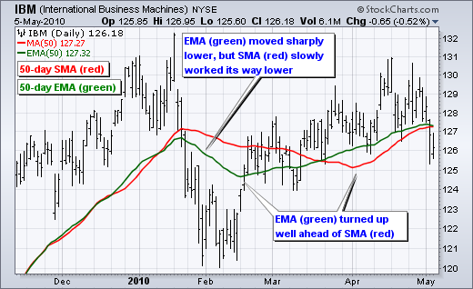

# EMA Crossover

This is a trading strategy called "EMA Regular Order Strategy" implemented in Python using the PyAlgoTrading library. The strategy is based on the exponential moving average crossover.

!!! Links
    - **[Strategy Code (.py)](https://github.com/algobulls/pyalgostrategypool/blob/master/pyalgostrategypool/ema_crossover.py){target=_blank}**
    - **[Strategy Structure (common methods used in a regular strategy)](strategy_guides/common_regular_strategy.md){target=_blank}**
    - **[Strategy Design (workflow of a strategy)](strategy_guides/structure.md){target=_blank}**

!!! Tips "Jupyter Notebooks for Indian Exchange (NSE)"
    - **[Click here to view a working notebook for NSE exchange in cloud. No installation required. ](https://nbviewer.org/github/algobulls/pyalgotrading/blob/2f3fb6fb83fd09981e286fe2f0930249a848cc8e/jupyter/nse_jupyter_notebooks/Moving%20Average%20Crossover.ipynb){target=_blank}**
    - **[Click here to execute a working notebook for NSE exchange in cloud. No installation required. ](https://mybinder.org/v2/gh/algobulls/pyalgotrading/0a1c06d6e159b3bebf2348efd198608b662c3ffc?urlpath=lab%2Ftree%2Fjupyter%2Fnse_equity%2Fmoving_average_crossover.ipynb){target=_blank}**

!!! Tips "Jupyter Notebook for US Exchange (NASDAQ)"
    - **[Click here to view a working notebook for NASDAQ exchange in cloud. No installation required. ](https://nbviewer.org/github/algobulls/pyalgotrading/blob/526dabc0a92775f4184aaab543c0a9f424613a55/jupyter/nasdaq_jupyter_notebooks/Moving%20Average%20Crossover%20US.ipynb){target=_blank}**
    - **[Click here to execute a working notebook for NASDAQ exchange in cloud. No installation required. ](https://mybinder.org/v2/gh/algobulls/pyalgotrading/52ec68cf886a116d72356da261d01537021d7710?urlpath=lab%2Ftree%2Fjupyter%2Fnasdaq_equity%2Fmoving_average_crossover_us.ipynb){target=_blank}**

## EMA indicator
Exponential Moving Averages (EMAs) are a popular technical analysis tool used in the stock market. They are similar to Simple Moving Averages (SMAs), but they place greater emphasis on recent price data.

Here is a summary of Exponential Moving Averages:

- An Exponential Moving Average is a type of moving average that assigns more weight to recent prices, making it more responsive to current market conditions.
- Unlike the SMA, which gives equal weight to all data points, the EMA assigns exponentially decreasing weights to older data points.
- The formula for calculating an EMA involves using a smoothing factor or multiplier that determines the weight given to the previous EMA value and the current price.
- The most common period used for EMAs is 12 and 26 days, representing short-term and long-term trends, respectively.
- EMAs are commonly used to identify trend direction, support and resistance levels, and potential entry or exit points.
- When the price crosses above the EMA, it may signal a bullish trend, while a cross below the EMA may suggest a bearish trend.
- The EMA is more responsive to price changes compared to the SMA, making it useful for short-term trading strategies.
- EMAs are often used in conjunction with other technical indicators, such as the Moving Average Convergence Divergence (MACD), to generate trading signals.
- Traders and investors use Exponential Moving Averages to smooth out price fluctuations, identify trend reversals, and determine potential support and resistance levels. They provide a visual representation of the average price over a specific period, with greater weight given to recent prices.

|  |
|: -- :|
| <b>Fig.1 - IBM candle chart (top) with EMA (green) and SMA (red) lines </b>|

## Strategy Overview
This strategy, called EMA Regular Order Strategy, implements a crossover strategy using Exponential Moving Averages (EMA). It generates entry and exit signals based on the crossover of two EMAs.

## Strategy Parameters
The following parameters can be configured for the strategy:

| Name              |  Default Value  | Expected Value                                                    | Description                                              |
|:------------------|:---------------:|:------------------------------------------------------------------|:---------------------------------------------------------|
| **TIME_PERIOD1**  |      None       | greater than 0                                                    | Period (number of candles) by which EMA-1 is calculated  |
| **TIME_PERIOD2**  |      None       | greater than 0                                                    | Period (number of candles) by which EMA-2 is calculated  |

## Crossover Calculation

The `get_crossover_value` method calculates the crossover value based on the two EMAs of the closing prices. It uses the `talib.EMA` function from the Talib library to calculate the EMAs. The method then determines the crossover between the two EMAs and returns the corresponding value (-1, 0, or 1).

