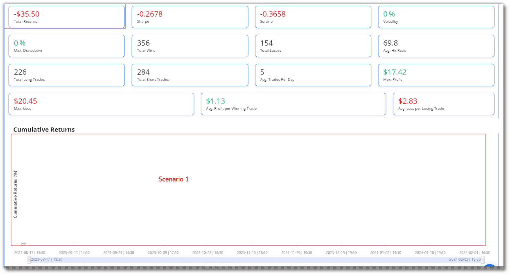
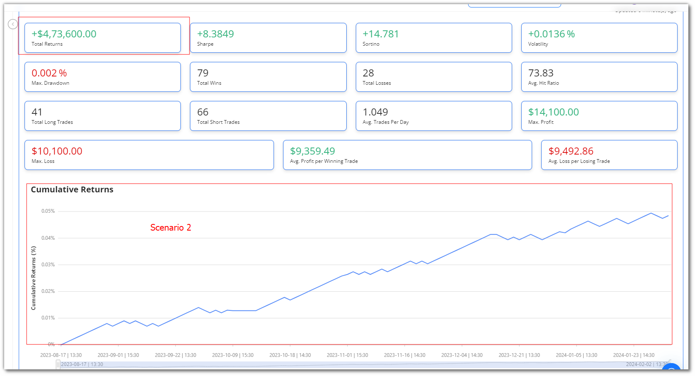
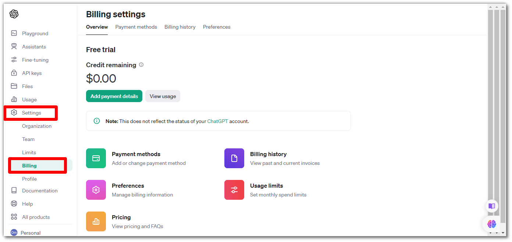

# Frequently Encountered Errors
This page provides insights into common errors encountered while developing and executing algorithmic trading strategies, along with their possible causes and solutions. These errors are often logged in the [user.log](https://github.com/algobulls/pyalgostrategypool/blob/master/pyalgostrategypool/aroon_crossover/golden/Aroon%20Crossover/2024-01-12/user.log)
file.
### `Execution time exceeded timeout_duration duration of 60 sec.`

#### Possible Causes

 - **Historical Data Fetching Duration:**
    
    Fetching historical data may take longer, especially if the duration is set to a large number of days.

 - **Suboptimal Decision-Making Logic:**
    
    The decision-making logic might be suboptimal, leading to increased processing time.

 - **Sequential Execution Approach:**
    
    A sequential approach of fetching historical data and then making the decisions in case of multiple instruments can contribute to delays.

 - **Real-Time Calculations:**
    
    If there are calculations that could be pre-conditioned or pre-calculated before the market opens, optimizing real-time calculations might help.

#### Solutions

 - **Optimize Historical Data Fetching:**
    
    Consider reducing the number of days for which historical data is fetched. A shorter duration, like 5 days, can be a reasonable compromise.

    ```python
    @staticmethod
    def get_historical_data_duration():
        return 5
    ```

 - **Optimize the Decision-Making logic:**

    Revisit your strategy logic and check if any code block can be optimized.

 - **Batch Processing for Decision-Making:**
    
    In case of multiple instruments, lets say you are fetching the historical data for the instrument, and have implemented the decision-making logic for whether this instrument should get selected for order placement or not. Once this is done, you repeat the same process for the next instrument. Instead of a sequential approach, try fetching historical data for all instruments in one loop and then making decisions for all instruments in another loop.

 - **Pre-Calculate Conditions:**
    
    Identify conditions that can be pre-calculated before the market opens. Adjust the strategy start time to accommodate these pre-calculations. If certain conditions can be chcked before the market starts, set the trading start time of the strategy to a value before the market start time. Add specific checks inside the strategy to ensure that the actual order placement, etc. are executed after the market starts.


### `No Data in Charts`

#### Description

Encountering the "NO data in charts" error while running a strategy is a common issue. This problem arises when using a small quantity with very large funds.

*Limited visibility on charts due to large funds with a small quantity setting.*
#### Possible Causes

   - **Scale Discrepancy:**

      The large fund amount may lead to extremely small values on the y-axis, which are not visible, causing charts to appear empty.

   - **Default Quantity and Funds:**

      Default quantity and funds settings, if not adjusted, may lead to similar issues with empty charts.

#### Solutions

   - **Normalize Values:**
   
      Normalize values by using larger quantities or scaling to ensure meaningful data display across various scenarios.

   - **Adjust Default Settings:**
   
      Consider adjusting default values to something more suitable for common scenarios.

*Charts displaying proper data with suitable funds and quantity settings*

### `OpenAI API Quota Depletion`

#### Description

The "OpenAI API current quota exceeded" error indicates that the current quota or available credits for the OpenAI API has been exhausted. This typically occurs when the allotted usage limit for the API key has been reached.

#### Possible Causes
   - **Credit Depletion:**
      
      The API key has utilized its entire quota or available credits.

#### Solutions

   - **Purchase More Credits:**

      To continue using the OpenAI API, consider purchasing additional credits or upgrading your plan to increase the quota. Click [here](https://platform.openai.com/account/billing/overview) to add more credits.
      
   
   - **Alternative Key:**

      If available, switch to a different API key that still has unused credits.