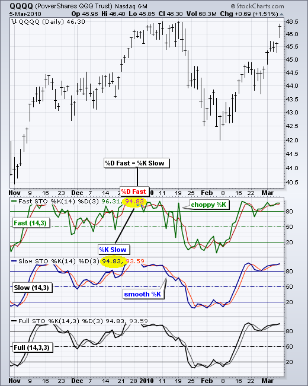

# Stochastic Crossover 

This is a trading strategy called "Stochastic Crossover" implemented in Python using the PyAlgoTrading library. The strategy is based on the Stochastic indicator crossover.

Click [here](https://github.com/algobulls/pyalgostrategypool/blob/master/pyalgostrategypool/stochastic_crossover.py) to check the strategy code.

# Stochastic Oscillator Indicator
In the stock market, Stochastic refers to the Stochastic Oscillator, which is a popular technical indicator used to analyze price momentum and identify potential trend reversals. The Stochastic Oscillator compares the closing price of a security to its price range over a specific period of time. It consists of two lines, %K and %D, and generates values between 0 and 100.

Here's a summary of the Stochastic Oscillator in the stock market:

- The Stochastic Oscillator measures the relationship between a security's closing price and its price range over a chosen period.
- The indicator consists of two lines: %K and %D. %K represents the current closing price relative to the price range, while %D is a smoothed average of %K.
- The Stochastic Oscillator is bound between 0 and 100. Readings above 80 are typically considered overbought, suggesting a potential price decline or correction. Readings below 20 are often considered oversold, indicating a potential price increase or rebound.
- Traders use the Stochastic Oscillator to identify potential trend reversals, as overbought or oversold conditions can indicate a possible change in the direction of the price trend.
- The indicator also generates bullish or bearish divergences, where the price trend and the Stochastic lines move in opposite directions, which can signal a potential trend reversal.
- The Stochastic Oscillator has various trading strategies associated with it, such as crossovers, overbought/oversold levels, and divergences, which traders use to make buy or sell decisions.
- It's important to note that the Stochastic Oscillator is a lagging indicator, meaning it may not provide precise timing for trade entries or exits. Therefore, it is often used in conjunction with other indicators and analysis techniques to confirm signals and improve the accuracy of trading decisions.
- Overall, the Stochastic Oscillator is a widely used technical indicator in the stock market that helps traders assess price momentum, identify overbought and oversold conditions, and spot potential trend reversals. By analyzing the relationship between the closing price and price range, traders can gain insights into potential buying or selling opportunities.

|  |
|: -- :|
| <b>Fig.1 - IBM candle chart (top) with Stochastic Fast (bottom) </b>|

|  |
|: -- :|
| <b>Fig.2 - QQQQ candle chart (top) with Stochastic Fast (bottom 1), Stochastic Slow (bottom 2) and Full Stochastic (bottom 3)</b>|

## Strategy Overview

The strategy follows a simple rule based on the Stochastic indicator crossover. When the Stochastic indicator's %K line crosses above the %D line, a buy signal is generated. Conversely, when the %K line crosses below the %D line, a sell signal is generated. The strategy aims to capture potential trend reversals.

## Strategy Parameters

The following parameters can be configured for the strategy:

- `FASTK_PERIOD` or `PERIOD`: The period for the fast %K line of the Stochastic indicator.
- `SLOWK_PERIOD` or `SMOOTH_K_PERIOD`: The period for the slow %K line of the Stochastic indicator.
- `SLOWD_PERIOD` or `SMOOTH_D_PERIOD`: The period for the slow %D line of the Stochastic indicator.

## Crossover Calculation

The `get_crossover_value` method calculates the crossover values for the Slow-K and Slow-D of Stochastic indicator using historical data of the instrument. The method returns the crossover values between slow-K and slow-D.
