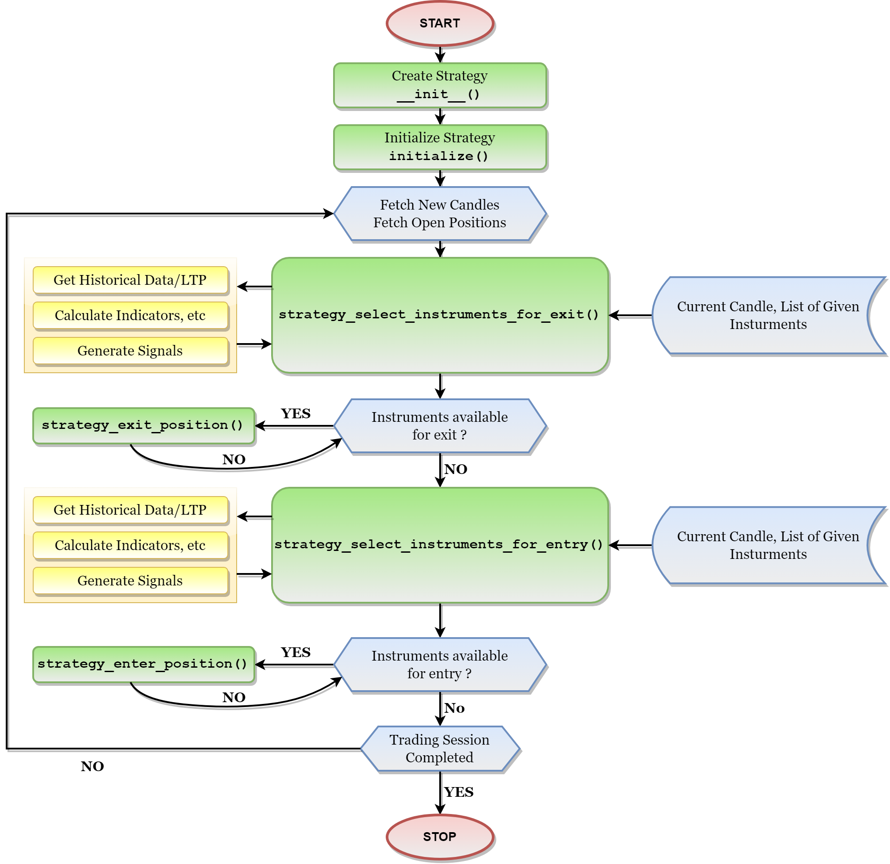

# Common Strategy Building Guide

## Understanding the Strategy Structure
The strategy code is basically a Python Class, with its Base Class as StrategyBase (for regular strategies) or StrategyBaseOptionsV2 (for options strategies). In this documentation we will focus on a regular strategy called ‘EMA Regular Order’  - a strategy which gives BUY and SELL signals based on two EMA indicators and takes new-entry & previous-exit at every crossover. We also will be discussing about an options strategy called "Options Bear Call Ladder Strategy" - strategy which uses 3 legs to optimize the risk and returns of the options. Inside the strategy class there are many methods that could be divided into 2 different sections: Mandatory Methods: Initialization Methods, 4-Core Loop Methods & Optional Methods: Algorithmic Calculation Methods & Miscellaneous Methods. These sections are explained briefly below.

### Mandatory Functions:

#### Initialization Methods
In this section, you will have the Strategy Class’ “__init__” method (a.k.a. Constructor). This method will extract the Strategy’s Configured Parameters and save them in the different variables. There is another method in this section called “initialization”, which will be called at the start of every trading day that will occur inside the timeline for which you are executing the strategy.

#### 4 Core Loop Methods
These are the main methods that will be called by the AlgoBulls Core in a sequence for every candle (candle is the minimum time range for which the Open, High, Low and Close values of that instrument are available. Basically it is a representation of a time period and the data corresponds to the trades executed during that period). All the logic design methods are called inside these Core Methods, along with the helping methods.

### Optional Function
#### Algorithmic Calculations Methods
This section contains the methods that are defined by the user. These are not mandatory but good to keep your code organized and simple. Their main purpose will be to perform operations on historical data or LTP data of the selected instrument.  Based on the results of these operations, it needs to decide whether it should Buy, Sell or take no action on the instrument.  
Apart from decision making, some of the other methods can also be useful to calculate the stop loss or target price for a trade.  
Point being, the purpose of these methods are totally dependent on the application of the user.

#### Miscellaneous Methods
These are handy methods that are created by a team of expert strategy developers and they are already a part of the base class. These methods do a lot of heavy lifting under the hood and can be used here for various purposes like getting the latest price of a stock, placing an order etc. These methods are not always necessary to be used and are generally a part of other methods mentioned above.

## Working Flow of the Strategy
Below Diagram is Sample Diagram on how the strategy execution engine works. Blocks in green are the mandatory methods that need to be implemented for every strategy.  

[](flowchart_structure_new.png)

---

## Setting Up: Imports and Environment

Before we dive into building of a strategy we need to fist setup our workspace depending the tool we are using.
The available tools for creating a workspace of strategy are **Pyalgotrading** and **Python Build Web**.  

### Pyalgotrading
If you're coding on your local machine, I recommend setting up a virtual environment and installing the "pyalgotrading" Python package to keep things organised.  
```
pip3 install pyalgotrading
```
Once you've got it installed, it's time to bring in the magic. Import the package and its constants into your Python file where your trading strategy will take shape.

```python
from pyalgotrading.algobulls import AlgoBullsConnection
from pyalgotrading.strategy import *
```

### Python Build Web
Now, if you prefer a web-based approach, we've got you covered. Head over to the "Code New Strategy" section on the Python Build page of the AlgoBulls website. Here, you can craft your strategy without the need to import any classes or packages. The choice is yours – flexibility at its best.

---

## Strategy Code Creation: Let's Get Started
With the groundwork laid, it's time to create your strategy class. Be sure to choose the appropriate base class for your strategy. For regular equity strategies, the base class is `StrategyBase` while for options strategies, it's `StrategyOptionsBaseV2`.

**Examples:**
=== "**Regular**"
    ```python
    class MovingAverageCrossoverV2(StrategyBase):
        name = 'Moving Average Crossover V2'
    ```

=== "**Options**"
    ```python
    class StrategyOptionsBearCallLadder(StrategyOptionsBaseV2):
        name = 'Options Bear Call Ladder Template'
    
    ```

Feel free to get creative with your class name, but it's good practice to make it unique among your strategy class names. Below this declaration, we set the strategy's name.

!!! Tip "For Pyalgotrading users"
    If you are uploading the strategy via pyalgotrading functions, then this `name` parameter's value will be the name of the strategy. That means this name will be displayed in **My Coded Strategies** section in Python Build.

---
### Initialization Functions
#### __init__()
Every great trading strategy starts with a solid foundation – the constructor method, also known as the "init" method. Here's what it looks like:

```python
def __init__(self, *args, **kwargs):
    super().__init__(*args, **kwargs)
```
Within this method, you extract the parameters provided by the user. These user-defined parameters are stored in a dictionary called "self.strategy_parameters." Here's how you can access these values:

```python
self.timeperiod1 = self.strategy_parameters['TIMEPERIOD1']
self.timeperiod2 = self.strategy_parameters['TIMEPERIOD2']
```
Feel free to initialise other variables here, such as `self.main_order`, `self.number_of_allowed_expiry_dates`, `self.transaction_type_map` and more.

**Example:**  
This is how the declaration of class along with its constructor would look like.

=== "**Regular**"
    ```python
    class StrategyEMARegularOrder(StrategyBase):
        name = 'EMA Regular Order Strategy'
    
        def __init__(self, *args, **kwargs):
            super().__init__(*args, **kwargs)
    
            self.timeperiod1 = self.strategy_parameters['TIMEPERIOD1']
            self.timeperiod2 = self.strategy_parameters['TIMEPERIOD2']
    
            self.main_order_map = None
    ```

=== "**Options**"
    ```python
    class StrategyOptionsBearCallLadder(StrategyOptionsBaseV2):
        name = 'Options Bear Call Ladder Template'
    
        def __init__(self, *args, **kwargs):
            super().__init__(*args, **kwargs)
    
            # Parameters (currently set with default values, can be overridden from the Parameters Configuration Pane)
            self._leg_one_transaction_type = self.strategy_parameters.get('LEG_ONE_TRANSACTION_TYPE', 1)  # BUY: 1 | SELL: 2
            self._leg_one_tradingsymbol_suffix = self.strategy_parameters.get('LEG_ONE_TRADING_SYMBOL_SUFFIX', 1)  # CE: 1 | PE: 2
            self._leg_one_strike_direction = self.strategy_parameters.get('LEG_ONE_STRIKE_DIRECTION', 1)  # ITM: 0| ATM: 1| OTM: 2
            self._leg_one_number_of_strikes = self.strategy_parameters.get('LEG_ONE_NUMBER_OF_STRIKES', 0)
    
            self._leg_two_transaction_type = self.strategy_parameters.get('LEG_TWO_TRANSACTION_TYPE', 1)  # BUY: 1 | SELL: 2
            self._leg_two_tradingsymbol_suffix = self.strategy_parameters.get('LEG_TWO_TRADING_SYMBOL_SUFFIX', 1)  # CE: 1 | PE: 2
            self._leg_two_strike_direction = self.strategy_parameters.get('LEG_TWO_STRIKE_DIRECTION', 2)  # ITM: 0| ATM: 1| OTM: 2
            self._leg_two_number_of_strikes = self.strategy_parameters.get('LEG_TWO_NUMBER_OF_STRIKES', 2)
    
            self._leg_three_transaction_type = self.strategy_parameters.get('LEG_THREE_TRANSACTION_TYPE', 2)  # BUY: 1 | SELL: 2
            self._leg_three_tradingsymbol_suffix = self.strategy_parameters.get('LEG_THREE_TRADING_SYMBOL_SUFFIX', 1)  # CE: 1 | PE: 2
            self._leg_three_strike_direction = self.strategy_parameters.get('LEG_THREE_STRIKE_DIRECTION', 0)  # ITM: 0| ATM: 1| OTM: 2
            self._leg_three_number_of_strikes = self.strategy_parameters.get('LEG_THREE_NUMBER_OF_STRIKES', 2)
    
            # Maps
            self.transaction_type_map = {1: "BUY", 2: "SELL"}
            self.tradingsymbol_suffix_map = {1: "CE", 2: "PE"}
            self.strike_direction_map = {0: OptionsStrikeDirection.ITM, 1: OptionsStrikeDirection.ATM, 2: OptionsStrikeDirection.OTM}
    
            # Variables
            self.number_of_allowed_expiry_dates = 1
            self.instruments_done_for_the_day = None
    ```

---
#### initialize()
The "**initialize**" method is your strategy's workspace, where you get everything ready for a fresh trading day. It's called at the start of each trading day, allowing you to reset variables, set up your tools, and perform any other tasks to ensure your strategy is primed and ready.

**Example:**

**Examples:**
=== "**Regular**"
    ```python
    def initialize(self):
        self.main_order_map = {}
    ```

=== "**Options**"
    ```python
    def initialize(self):
        super().initialize()
        self.instruments_done_for_the_day = []

    ```

---

### Algorithmic Calculation Functions
#### get_decision()
Now, let's dive into the heart of your strategy – the "get_decision" method. This method is where the magic happens, where you decide when to enter or exit a trade, set stop losses, and target prices. Here's how it works:
Historical data of the instrument up to a certain point in your strategy is collected using:

- Historical data is a time series data of open, high, low and close values of an instrument. These values are fetched at an interval same as that of the candle interval. The method given below fetches multiple historical data values till the current candle on which the strategy is executing. Historical data of the instrument up to a certain point in your strategy is collected using:
    ```python
    hist_data = self.get_historical_data(instrument)
    ```
  Here the variable hist_data is a pandas.Dataframe object. A Pandas DataFrame is a 2 dimensional data structure, like a 2 dimensional array, or a table with rows and columns. The hist_data Dataframe will have 4 columns named as : “open”, “high”, “close“ and “low”. For every row there will be a unique timestamp and the difference between each timestamp is of candle interval.
- To access all the values of one particular column from the hist_data, you can use the following syntax code. Remember the data type of the column fetched here is pandas.Series
    ```python
    hist_data[‘<column_name>’]
    ```
    **Example:**
    ```python
    close = hist_data[‘close’]
    ```
- To access the O-H-L-C values of the current latest candle you can use the following code. This also tells us that the index -1 is for latest, -2 will be for second latest and so on. This also implies that index 0 will get the oldest data, index 1 will give second oldest data and so on.  
    ```python
    latest_ohlc = hist_data.iloc[-1]
    ```
- Next, you analyse this historical data to determine trading signals and calculate indicator values. You can rely on functions from "talib" for this, as shown below:
	```python
    ema_x = talib.EMA(hist_data['close'], timeperiod=self.timeperiod1)
    ema_y = talib.EMA(hist_data['close'], timeperiod=self.timeperiod2)
    ```
    As you can see, we have passed the “close” column and a strategy parameter value called “self.timeperiod1” and “self.timeperiod2” to the talib function. Each of the talib functions require unique input values, some require pandas.Series, some require constants like integers and floats and some require both. To understand the working of each talib function, refer here.

- Next, you analyze this data to determine trading signals and calculate indicator values. You can rely on functions from "**talib**" for this, as shown below:
    ```python
    ema_x = talib.EMA(hist_data['close'], timeperiod=self.timeperiod1)
    ema_y = talib.EMA(hist_data['close'], timeperiod=self.timeperiod2)
    ```
    As you can see, we have passed the “close” column and a strategy parameter value called “self.timeperiod1” and “self.timeperiod2” to the talib function. Each of the talib functions require unique input values, some require pandas.Series, some require constants like integers and floats and some require both. To understand the working of each talib function, refer here.
- In many strategies, the condition to buy or sell can be triggered based on the crossover direction of 2 signals/indicators. A crossover refers to an instance where an indicator and a price, or multiple indicators, overlap and cross one another. Crossovers are used in technical analysis to confirm patterns and trends such as reversals and breakouts, generating buy or sell signals accordingly. Below we have given an example of how to calculate the crossover of the 2 indicator values we had calculated above.  
    ```python
    crossover_value = self.utils.crossover(ema_x, ema_y)
    ```
    Here if crossover_value is 0 then the indicators ema_x and ema_y have not crossed. If it is 1 then indicator ema_x has crossed ema_y in upward direction. Similarly if it is -1 then indicator ema_x has crossed ema_y in downward direction

By combining these calculated values with historical data, you can make informed decisions about when to initiate or close a trade. Additionally, you can use this information to compute potential target prices or set stop losses.  
AlgoBulls' Python Build empowers you to navigate the complexities of options trading with ease. 

**Example:**  

This is how an ideal get_decision() function would look like. This example is from RSI Crossover Strategy.

```python
def get_crossover_value(self, instrument):
    hist_data = self.get_historical_data(instrument)

    rsi_value = talib.RSI(hist_data['close'],    timeperiod=self.time_period)

    oversold_list = [self.oversold_value] * rsi_value.size
    overbought_list = [self.overbought_value] * rsi_value.size

    oversold_crossover_value = self.utils.crossover(rsi_value, oversold_list)
    overbought_crossover_value = self.utils.crossover(rsi_value, overbought_list)

    return oversold_crossover_value, overbought_crossover_value
```

---
### Miscellaneous Functions
#### get_child_instrument_details()
The **get_child_instrument_details** function is at your disposal. It takes several parameters:  

- **base_instrument**: The foundation of your options strategy, often represented by an index.
- **tradingsymbol_suffix**: Specifies whether the option should be a call option (CE) or a put option (PE), determining the trading symbol's suffix.
- **strike_direction**: Defines the direction relative to the current strike price, with options like "In The Money" (ITM), "Out of The Money" (OTM), and "At the Money" (ATM).
- **no_of_strikes**: Specifies how many strikes away from the current strike price the function should consider, setting the distance in strike prices within the chosen strike direction.

This function calls two other functions: `self.get_allowed_expiry_dates()` and `get_options_instrument_with_strike_direction()`.

**Example:**  
This is how the function looks ideally. This example was taken from “Options Bear Call Strategy” from ready templates.

```python
    def get_child_instrument_details(self, base_instrument, tradingsymbol_suffix, strike_direction, no_of_strikes):
        expiry_date = self.get_allowed_expiry_dates()[0]
        child_instrument = self.get_options_instrument_with_strike_direction(base_instrument, expiry_date, tradingsymbol_suffix, strike_direction, no_of_strikes)
        return child_instrument
```

---
#### get_allowed_expiry_dates()
In options strategies, the **get_allowed_expiry_dates** function plays a vital role. It doesn't require parameters; instead, it relies on the **number_of_allowed_expiry_dates** variable defined in the constructor method.  

* If **number_of_allowed_expiry_dates** is set to 1, the function returns the monthly expiry date.
* If **number_of_allowed_expiry_dates** is set to 0, the function returns a weekly expiry date.

In essence, this function helps you select the appropriate expiry date based on the value you assign to `number_of_allowed_expiry_dates` variable.

---

#### get_options_instrument_with_strike_direction()
This function is a key player in options strategies, taking parameters such as:  

* **base_instrument**: The foundation of your options strategy.
* **expiry_date**: The expiry date of the child instrument, calculated using the "get_allowed_expiry_dates" function.
* **tradingsymbol_suffix**: Specifies whether the option should be a call option (CE) or a put option (PE), helping identify the appropriate options.
* **strike_direction**: Determines the direction in relation to the current strike price, offering options like "In The Money" (ITM), "Out of The Money" (OTM), and "At the Money" (ATM).
* **no_of_strikes**: Specifies how many strikes away from the current strike price the function should consider, defining the distance in strike prices within the chosen strike direction.


#### options_instruments_set_up_local()
Now, let's talk about a crucial piece of the options strategy puzzle – `options_instruments_set_up_local`. This function creates local instances of all available child instruments based on specified parameters:  

* **base_instrument**: The foundation of your options strategy, typically an index.
* **tradingsymbol_suffix**: Specifies whether the child instrument should be a call option (CE) or a put option (PE), aiding in the identification of the appropriate options.
* **current_close** (strike_price): The current price of the base instrument, also known as the strike price.
* **direction**: Determines the direction in relation to the current strike price, helping select the child instrument (i.e., ATM, ITM, or OTM).

Once executed, this function sets up and stores local instances of child instruments matching your criteria. These instances become valuable assets for further analysis or operations, including utilising the "get_child_instrument_details" function.

**Example:**  
This is how this function looks ideally. This example was taken from “Options Bear Call Ladder” from ready templates.

```python
def options_instruments_set_up_local(self, base_instrument, tradingsymbol_suffix, current_close, direction=OptionsInstrumentDirection.EXACT):
        expiry_dates = self.get_allowed_expiry_dates()
        for expiry_date in expiry_dates:
            self.options_instruments_set_up(base_instrument, direction, expiry_date, tradingsymbol_suffix, current_close)
```

---

#### options_instruments_set_up()
The final piece of the puzzle is "options_instruments_set_up." This function takes parameters like:  

* **base_instrument**: The foundation of your options strategy.
* **direction**: Determines the direction in relation to the current strike price, helping select the child instrument (i.e., ATM, ITM, or OTM).
* **expiry_date**: The expiry date of the child instrument, calculated using the "get_allowed_expiry_dates" function.
* **tradingsymbol_suffix**: Specifies whether the child instrument should be a call option (CE) or a put option (PE), aiding in the identification of the appropriate options.
* **current_close**: The current price of the base instrument, also known as the strike price.

---

Now, let's talk about the engine that drives your strategy – the core loop functions. 

These include "**strategy_select_instruments_for_entry**", "**strategy_enter_position**", "**strategy_select_instruments_for_exit**" and "**strategy_exit_position**" These functions are called within a loop from the AlgoBulls core until an Exit Event for the strategy occurs.

---
### The 4 Core Loop Functions
#### strategy_select_instruments_for_entry()
This function takes parameters:  

* **candle**: The current candle where the strategy is executing its algorithm.
* **instrument_bucket**: A list of all the instruments provided by the user when starting the strategy.
Here, you iterate through the instruments, calling "self.get_decision()" to determine actions for each. For options strategies, you can also use "self.options_instruments_set_up_local()" to set up child instruments for each base instrument. The selected instruments and their meta-information are returned by the function.

**Example**:  
This function would ideally look like this. This example was taken from “Options Straddle” from Ready Templates.

**Examples:**
=== "**Regular**"
    ```python
    def strategy_select_instruments_for_entry(self, candle, instruments_bucket):
        selected_instruments, meta = [], []

        for instrument in instruments_bucket:
            crossover = self.get_decision(instrument)
            action_constants = {1: 'BUY', -1: 'SELL'}

            if crossover in [-1, 1]:
                selected_instruments.append(instrument)
                meta.append({'action': action_constants[crossover]})

        return selected_instruments, meta

    ```

=== "**Options**"
    ```python
    def strategy_select_instruments_for_entry(self, candle, instruments_bucket):
        selected_instruments, meta = [], []

        for instrument in instruments_bucket:
            if instrument not in self.instruments_done_for_the_day:
                self.instruments_done_for_the_day.append(instrument)
                ltp = self.broker.get_ltp(instrument)

                self.options_instruments_set_up_local(instrument, "CE", ltp)
                self.options_instruments_set_up_local(instrument, "PE", ltp)

                leg_wise_list = [('LEG_ONE', self._leg_one_tradingsymbol_suffix, self._leg_one_strike_direction, self._leg_one_number_of_strikes, self._leg_one_transaction_type),
                                 ('LEG_TWO', self._leg_two_tradingsymbol_suffix, self._leg_two_strike_direction, self._leg_two_number_of_strikes, self._leg_two_transaction_type),
                                 ('LEG_THREE', self._leg_three_tradingsymbol_suffix, self._leg_three_strike_direction, self._leg_three_number_of_strikes, self._leg_three_transaction_type)]

                for leg_number, tradingingsymbol_suffix, strike_direction, number_of_strikes, transaction_type in leg_wise_list:
                    self.logger.info(f'Processing {leg_number}...')
                    child_instrument = self.get_child_instrument_details(instrument, self.tradingsymbol_suffix_map[tradingingsymbol_suffix], self.strike_direction_map[strike_direction], number_of_strikes)
                    selected_instruments.append(child_instrument)
                    meta.append({'base_instrument': instrument, 'action': self.transaction_type_map[transaction_type]})

        return selected_instruments, meta

    ```

---
#### strategy_enter_position()
This function takes parameters:  

* **candle**: The current candle where the strategy is executing its algorithm.
* **instrument**: One of the instruments from the selected instruments list returned by "strategy_select_instruments_for_entry."
* **meta**: Meta-information of that particular instrument, aligning with the instrument from the meta list.

Here, you place orders for the selected instruments, updating them in "self.main_order" for easy access in exit functions.

**Example**:  
This function would ideally look like this. This example was taken from “Options Straddle” from Ready Templates.

**Examples:**
=== "**Regular**"
    ```python
    def strategy_enter_position(self, candle, instrument, meta):
        self.main_order_map[instrument] = _ = self.broker.OrderRegular(instrument, meta['action'], quantity=self.number_of_lots * instrument.lot_size)
        return _

    ```

=== "**Options**"
    ```python
    def strategy_enter_position(self, candle, instrument, sideband_info):
        _ = self.broker.OrderRegular(instrument, sideband_info['action'], quantity=self.number_of_lots * instrument.lot_size)
        return _
    ```

#### strategy_select_instruments_for_exit()
Similar to entry, this function takes parameters:

* **candle**: The current candle where the strategy is executing its algorithm.
* **instrument_bucket**: A list of all instruments provided by the user when starting the strategy.

The function iterates through the instrument bucket, checking if the instrument is present in "self.main_order" and whether its exit condition is satisfied. Instruments meeting exit conditions are added to the selected instruments list, along with their respective actions and meta-information.

**Example**:  
This function should ideally look like this. This example was taken from “EMA Crossover Strategy”.

```python    
    def strategy_select_instruments_for_exit(self, candle, instruments_bucket):
        selected_instruments, meta = [], []

        for instrument in instruments_bucket:
            if self.main_order_map.get(instrument) is not None:
                crossover = self.get_decision(instrument)

                if crossover in [1, -1]:
                    selected_instruments.append(instrument)
                    meta.append({'action': 'EXIT'})

        return selected_instruments, meta
```

---
#### strategy_exit_position()
Finally, this function takes parameters:

* **candle**: The current candle where the strategy is executing its algorithm.
* **instrument**: One of the instruments from the selected instruments list returned by "strategy_select_instruments_for_exit."
* **meta**: Meta-information of that particular instrument, aligning with the instrument from the meta list.

Here, you place orders for the selected instruments, removing them from "self.main_order" to prepare for the next iteration of the AlgoBulls core loop.

**Example:**  
This function should ideally look like this. This example was taken from “EMA Crossover Strategy”.

```python
    def strategy_exit_position(self, candle, instrument, meta):
    if meta['action'] == 'EXIT':
        self.main_order_map[instrument].exit_position()
        self.main_order_map[instrument] = None
        return True
    return False
```