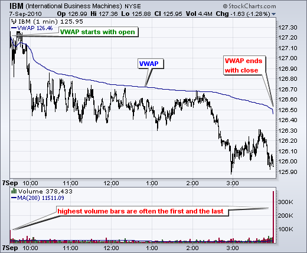

# VWAP Crossover 

This is a trading strategy called "VWAP Crossover" implemented in Python using the PyAlgoTrading library. The strategy is based on the crossover of the VWAP (Volume Weighted Average Price) indicator.

!!! Links
    - **[Strategy Code (.py)](https://github.com/algobulls/pyalgostrategypool/blob/master/pyalgostrategypool/vwap_crossover.py){target=_blank}**
    - **[Strategy Structure (common methods used in a regular strategy)](strategy_guides/common_regular_strategy.md){target=_blank}**
    - **[Strategy Design (workflow of a strategy)](strategy_guides/structure.md){target=_blank}**

!!! Tips "Jupyter Notebook for Indian Exchange (NSE)"
    - **[Click here to view a working notebook for NSE exchange in cloud. No installation required. ](https://nbviewer.org/github/algobulls/pyalgotrading/blob/2f3fb6fb83fd09981e286fe2f0930249a848cc8e/jupyter/nse_jupyter_notebooks/VWAP%20Crossover.ipynb){target=_blank}**
    - **[Click here to execute a working notebook for NSE exchange in cloud. No installation required. ](https://mybinder.org/v2/gh/algobulls/pyalgotrading/52ec68cf886a116d72356da261d01537021d7710?urlpath=lab%2Ftree%2Fjupyter%2Fnse_equity%2Fvwap_crossover.ipynb){target=_blank}**

!!! Tips "Jupyter Notebook for US Exchange (NASDAQ)"
    - **[Click here to view a working notebook for NASDAQ exchange in cloud. No installation required. ](https://nbviewer.org/github/algobulls/pyalgotrading/blob/526dabc0a92775f4184aaab543c0a9f424613a55/jupyter/nasdaq_jupyter_notebooks/VWAP%20Crossover%20US.ipynb){target=_blank}**
    - **[Click here to execute a working notebook for NASDAQ exchange in cloud. No installation required. ](https://mybinder.org/v2/gh/algobulls/pyalgotrading/52ec68cf886a116d72356da261d01537021d7710?urlpath=lab%2Ftree%2Fjupyter%2Fnasdaq_equity%2Fvwap_crossover_us.ipynb){target=_blank}**

## VWAP indicator
In the stock market, VWAP stands for Volume-Weighted Average Price. VWAP is a trading indicator that calculates the average price at which a particular stock or security has traded throughout the day, taking into account both the price and the volume of each trade.

Here is a summary of VWAP in the stock market:

- VWAP is calculated by multiplying the price of each trade by the corresponding volume and then summing up these values over a specific time period. The total value is divided by the cumulative volume to obtain the average price.
- The volume-weighted aspect of VWAP gives more weight to trades with higher volume, reflecting the significance of larger trades in the overall average price calculation.
- VWAP is typically calculated on an intraday basis, such as the trading day or a specific session, and resets at the start of each new period.
- Traders and investors use VWAP as a benchmark to assess whether their own trades are executed at a better or worse price compared to the average market price. It helps evaluate the quality of their execution and determine if they are buying or selling at a favorable price.
- VWAP is commonly used by institutional traders who execute large orders as it helps them minimize market impact and avoid unfavorable executions. By comparing their execution price to VWAP, they can assess their performance and adjust their trading strategies accordingly.
- In addition to being used as a benchmark, VWAP is also employed as a trading strategy. Some traders use VWAP as a reference point for making buy or sell decisions. For example, if the current price is above VWAP, it may be considered bullish, while a price below VWAP could be seen as bearish.
- VWAP is often displayed as a line on intraday price charts, allowing traders to visually compare the current price to the average price. It can provide insights into the market's overall sentiment and potential support or resistance levels.
- It is important to note that VWAP is a lagging indicator since it is based on historical data. Therefore, it is often used in combination with other indicators and analysis techniques to validate trade signals and make informed trading decisions.
- Overall, VWAP is a widely used indicator in the stock market that provides a volume-weighted average price, serving as a benchmark for evaluating trade execution quality and as a reference point for trading decisions. By considering both price and volume, VWAP offers insights into market dynamics and helps traders assess their performance relative to the average market price.

|  |
|: -- :|
| <b>Fig.1 - IBM candle chart (top) with VWAP line  (Blue), Volume chart with SMA line</b>|

## Strategy Overview

The strategy follows a simple rule based on the crossover of the VWAP indicator. When the price crosses above the VWAP, a buy signal is generated, and when the price crosses below the VWAP, a sell signal is generated. The strategy aims to capture potential trend reversals based on the VWAP.

## Strategy Parameters

No specific strategy parameters are mentioned in the code. 

## Crossover Calculation

The `get_crossover_value` method calculates the VWAP from historical data and the crossover values for the VWAP of the instrument. The method returns the crossover values between close of hist data and vwap.

