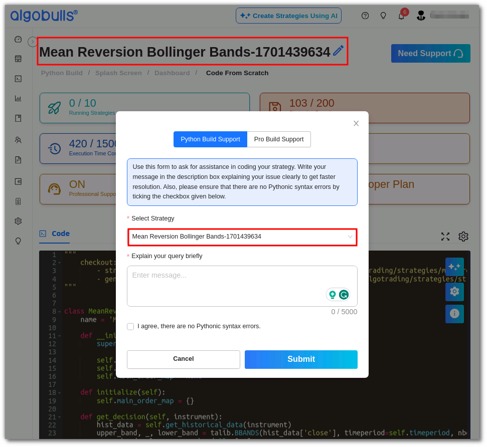

In this dedicated section, you'll find everything you need to receive the support you deserve for pyalgotrading. Whether it's troubleshooting an issue or seeking clarification, we've got you covered every step of the way.
Requesting Support from pyalgotrading Module:

If you're looking to raise a support request from pyalgotrading module, follow these simple steps:
 ```
- Start by executing your strategy from the pyalgotrading module.
- Next, navigate to the "My Coded Strategies" section in Phoenix web.
 ```

**My Coded Strategies:** This section displays all the strategies you've created or modified. It includes both new and updated strategies.

[](../python_build/imgs_v2/python_build_my_strategies.png)

From this section, select the strategy you're experiencing issues with.

**Need Support:** If you require assistance with a specific strategy, you can raise a support request from here. Please ensure that your strategy is present in the `My Coded Strategies` section.

[](../python_build/imgs_v2/python_build_need_support.png)

After clicking on `Need Support`, you'll see a popup window. Here, select the strategy for which you need assistance and explain you issue in brief.

[](../python_build/imgs_v2/python_build_select_strategy.png)

Then, click the `Submit` button. Our support team will actively assist you with any issues you're facing.