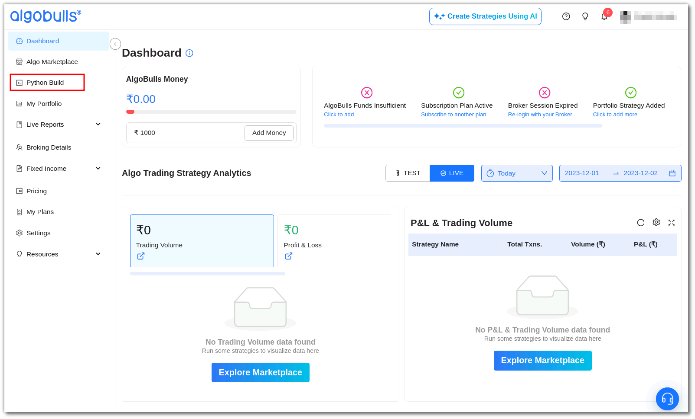
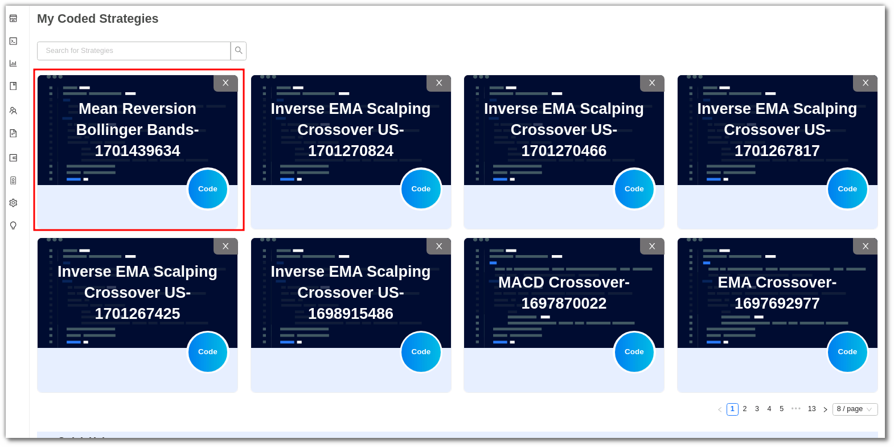

Welcome to the realm of unparalleled support at AlgoBulls, where your algorithmic trading journey takes centre stage. Whether you're navigating the Phoenix Web or harnessing the power of pyalgotrading, our commitment to your success remains unwavering. The Phoenix Support page is your gateway to a world where every query, every challenge is met with expertise and dedication. We understand that your experience matters, and so does every line of code you craft.
## Steps to get the support you need.
### Choose your strategy

- Log in to your AlgoBulls account and choose Phoenix from the left-side menu.
    
- From the Phoenix Splash Screen, choose the `My Coded Strategies` section display card. This is the section that holds all your saved strategies, whether you have coded them from scratch or modified them from ready templates.
    
- Click and open the strategy that you think requires our assistance.

    

### Need Support 
- In the chosen strategy, click on the `Need Support` button on the top right corner of the page.

    

- From the pop-up window that appears, click on the `Select Strategy` dropdown and choose the name of your strategy.
- Write your query in the `Explain your query briefly` dialog box. This will help our team to get the best solution for you.

- Click the `Submit` button. Our team will reach out to you with the solution within 1-2 business days.
    