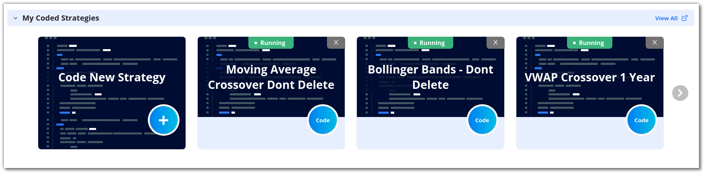

In this section, you 'll find everything you need to get the support you require. Whether its troubleshooting a problem or clarifying a doubt we've got you coverd

**My Coded Strategies:** This section displays all the strategies you've created or modified. It includes both new and updated strategies.

From this section, select the strategy you're experiencing issues with.

**Need Support:** If you require assistance with a specific strategy, you can raise a support request from here. Please ensure that your strategy is present in the `My Coded Strategies` section.

After clicking on `Need Support`, you'll see a popup window. Here, select the strategy for which you need assistance.

Then, click the `Submit` button. Our support team will actively assist you with any issues you're facing.